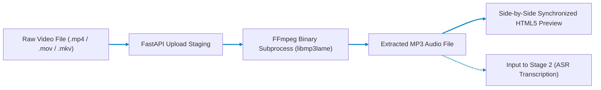

# Stage 1: Audio Extractor & Stem Separator

## High-Fidelity MP4 to MP3 Demuxing & Stem Isolation Service

Part of the **Nativox** AI Multilingual Dubbing Suite.

[](../README.md)
[](../02_MP3_to_Text/README.md)
[](../ARCHITECTURE.md)
[](https://python.org)
[](https://fastapi.tiangolo.com)

---

## 📖 Operational Overview

Stage 1 is the primary audio extraction gate for the Nativox pipeline. It ingests video content, renders a live playback preview in the browser, and extracts the pristine audio track into high-bitrate MP3 format using an asynchronous FFmpeg worker.

The extracted MP3 serves as the clean acoustic input for **Stage 2 (Automatic Speech Recognition & Formant Analysis)**.

---

## 🛠️ Tech Stack & Key Features

- **Backend:** FastAPI (Python 3.11 asynchronous server) + FFmpeg binary subprocess
- **Audio Codec:** `libmp3lame` variable/high-quality VBR encoding (`-q:a 2`, ~190 kbps)
- **Frontend:** Responsive vanilla HTML5, CSS3 glassmorphism, and modern JavaScript with dual side-by-side synchronized media players
- **Storage Management:** Segregated temp upload staging with automatic session isolation

---

## 📋 Prerequisites & Requirements

- **Python:** **3.11** (Repository pinned via root `.python-version`)
- **FFmpeg:** Required on system PATH:
  - **Windows (winget):** `winget install Gyan.FFmpeg`
  - **macOS (Homebrew):** `brew install ffmpeg`
  - **Linux (Debian/Ubuntu):** `sudo apt update && sudo apt install -y ffmpeg`
- Verify installation in your terminal:

  ```bash
  ffmpeg -version
  ```

---

## 🚀 Setup & Execution

### 1. Navigate to Backend Directory

```bash
cd 01_MP4_to_MP3/backend
```

### 2. Create & Activate Virtual Environment

- **Create Environment (Python 3.11):**

  ```bash
  python -m venv venv
  ```

- **Activate on Windows (PowerShell):**

  ```powershell
  .\venv\Scripts\Activate.ps1
  ```

- **Activate on Windows (CMD):**

  ```cmd
  venv\Scripts\activate.bat
  ```

- **Activate on macOS / Linux / Git Bash:**

  ```bash
  source venv/bin/activate
  ```

### 3. Install Dependencies & Launch Server

```bash
pip install -r requirements.txt
python -m uvicorn main:app --reload --port 8000
```

The web interface will open at **`http://127.0.0.1:8000`**.

> [!IMPORTANT]
> **Access via `http://127.0.0.1:8000`, not raw `index.html`:**
> The FastAPI backend serves `frontend/index.html` directly on port `8000`. Opening `index.html` directly via `file:///` causes browser CORS errors that block requests to `/extract`.

---

## 🏛️ Pipeline Architecture



---

## 🔌 API Reference

### `POST /extract`

Extracts pristine MP3 audio from the uploaded video file.

- **Content-Type:** `multipart/form-data`
- **Request Body:** `video` (Binary File: `.mp4`, `.mov`, `.mkv`, `.avi`, `.webm`)
- **Response Body:**

  ```json
  {
    "status": "success",
    "video_url": "/video/session_id.mp4",
    "audio_url": "/audio/session_id.mp3",
    "filename": "session_id.mp3",
    "duration_seconds": 45.2,
    "codec": "libmp3lame",
    "bitrate": "192k"
  }
  ```

### `GET /video/{filename}`

Streams the uploaded video file with range requests for seeking.

### `GET /audio/{filename}`

Streams the extracted MP3 audio file with range requests for seeking.

---

## 📁 Project Structure

```text
01_MP4_to_MP3/
├── README.md               # Stage documentation
├── backend/
│   ├── main.py             # FastAPI REST endpoints & FFmpeg subprocess executor
│   └── requirements.txt    # FastAPI, Uvicorn, Python-Multipart
├── frontend/
│   └── index.html          # Dual-player side-by-side UI
└── storage/
    ├── uploads/            # Temporary incoming video files
    └── outputs/            # Transcoded audio output files
```

---

## 👥 Authors & Academic Context

- **Student Contributors:** Atanu Saha, Babin Bid, Rohit Kr Adak, Sagnik Bachhar
- **Faculty Guide:** Dr. Debjit Ghosh (Department of Computer Science & Engineering)
- **Suite:** Nativox Modular Real-Time AI Multilingual Dubbing Suite

---

<!-- markdownlint-disable MD033 -->
<p align="center">
  <a href="../README.md">🏠 Back to Suite Overview</a> &bull; <a href="../ARCHITECTURE.md">🏛️ Architecture</a> &bull; <a href="../INSTRUCTIONS.md">📖 Instructions</a> &bull; <a href="../ROADMAP.md">🗺️ Roadmap</a>
</p>

<p align="center">
  <sub><b>Nativox</b> &bull; Real-Time AI Multilingual Dubbing Suite &bull; <b>End of Module 1 Documentation</b></sub>
</p>
<!-- markdownlint-enable MD033 -->
