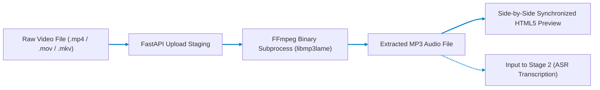

# Stage 1: Audio Extractor & Stem Separator

## High-Fidelity MP4 to MP3 Demuxing & Stem Isolation Service

Part of the **Nativox** AI Multilingual Dubbing Suite.

<!-- markdownlint-disable MD033 -->
<p align="center">
  <a href="../README.md"></a>
  <a href="../02_MP3_to_Text/README.md"></a>
  <a href="../ARCHITECTURE.md"></a>
  <a href="https://python.org"></a>
  <a href="https://fastapi.tiangolo.com"></a>
</p>
<!-- markdownlint-enable MD033 -->

---

## 📖 Operational Overview

Stage 1 is the primary audio extraction gate for the Nativox pipeline. It ingests video content, renders a live playback preview in the browser, and extracts the pristine audio track into high-bitrate MP3 format using an asynchronous FFmpeg worker.

The extracted MP3 serves as the clean acoustic input for **Stage 2 (Automatic Speech Recognition & Formant Analysis)**.

---

## 🛠️ Tech Stack: Architectural Rationale & Comparative Evaluation

| Technology | Purpose in Pipeline | Why It Is Chosen Over Existing Alternatives | Viable Alternatives & Trade-Off Analysis |
| :--- | :--- | :--- | :--- |
| **FastAPI (0.111.0)** | Asynchronous microservice API engine and static file server | Provides non-blocking native async I/O with automatic Pydantic validation and high concurrency. Outperforms Flask and Django with significantly lower latency and smaller memory footprint during large multi-megabyte file uploads. | **Flask / Django:** Slower throughput on concurrent upload/download streams; synchronous by default unless paired with complex gevent/Celery infrastructure. |
| **FFmpeg (`libmp3lame`)** | Binary-level video-to-audio demuxing, stream isolation, and MP3 encoding | Industry gold-standard C library executing direct stream demuxing via hardware/OS subprocesses. Encodes using VBR `-q:a 2` (~190 kbps) for optimal acoustic fidelity and speech clarity with minimal CPU overhead. | **MoviePy / PyAV / pydub:** Higher memory consumption (MoviePy loads frames into RAM using NumPy arrays); slower extraction times and prone to Python Global Interpreter Lock (GIL) bottlenecks. |
| **Vanilla HTML5 / CSS3 / ES6 JS** | Dual-player synchronized preview and glassmorphic user dashboard | Zero dependency build footprint; loads instantaneously without npm/Node.js tooling or compilation overhead. Dual synchronized `<video>` and `<audio>` tags give immediate verification before proceeding downstream. | **React / Vue / Next.js:** Introduces heavy Node.js build pipelines, node_modules bloat, and hydration lag for a focused media tool. |
| **Pydantic v2** | Request validation, filename sanitization, and structured error schemas | Rust-backed validation core provides near-zero overhead parsing and strict typing, preventing directory traversal and malformed payload injection. | **Marshmallow / Cerberus:** Pure-Python parsing that is 5x–10x slower on payload validation and lacks native OpenAPI schema generation. |

---

## 📋 Prerequisites & Requirements

- **Python:** **3.11** (Repository pinned via root `.python-version`)
- **FFmpeg:** Required on system PATH:
  - **Windows (winget):** `winget install Gyan.FFmpeg`
  - **macOS (Homebrew):** `brew install ffmpeg`
  - **Linux (Debian/Ubuntu):** `sudo apt update && sudo apt install -y ffmpeg`
- Verify installation in your terminal:

  ```bash
  ffmpeg -version
  ```

---

## 🚀 Setup & Execution

### 1. Navigate to Backend Directory

```bash
cd 01_MP4_to_MP3/backend
```

### 2. Choose Your Setup Track

> [!IMPORTANT]
> **Must Use Python 3.11 (Avoid Python 3.14+):**
> On Windows where Python 3.14+ is installed as default, running a generic `python -m venv venv` creates a Python 3.14 environment lacking prebuilt binary wheels for C/Rust dependencies. Explicitly use Python 3.11.
> In PowerShell, never type `.\venv` alone (it is a directory); always run `.\venv\Scripts\Activate.ps1`.

---

#### Track 1 — Standard Python Setup (Requires Python 3.11)

Use this track if your default system `python` command is Python 3.11.

- **Windows PowerShell:**

  ```powershell
  python -m venv venv
  .\venv\Scripts\Activate.ps1
  pip install -r requirements.txt
  python -m uvicorn main:app --reload --port 8000
  ```

- **Windows Git Bash:**

  ```bash
  python -m venv venv
  source venv/Scripts/activate
  pip install -r requirements.txt
  python -m uvicorn main:app --reload --port 8000
  ```

- **macOS / Linux:**

  ```bash
  python3 -m venv venv
  source venv/bin/activate
  pip install -r requirements.txt
  python -m uvicorn main:app --reload --port 8000
  ```

---

#### Track 2 — Fast Setup with `uv` (Recommended)

Use this track for instant zero-configuration setup — `uv` automatically respects the repository's `.python-version` (3.11).

- **Windows PowerShell:**

  ```powershell
  uv venv --seed venv
  .\venv\Scripts\Activate.ps1
  pip install -r requirements.txt
  python -m uvicorn main:app --reload --port 8000
  ```

- **Windows Git Bash:**

  ```bash
  uv venv --seed venv
  source venv/Scripts/activate
  pip install -r requirements.txt
  python -m uvicorn main:app --reload --port 8000
  ```

- **macOS / Linux:**

  ```bash
  uv venv --seed venv
  source venv/bin/activate
  pip install -r requirements.txt
  python -m uvicorn main:app --reload --port 8000
  ```

The web interface will open at **`http://127.0.0.1:8000`**.

> [!IMPORTANT]
> **Access via `http://127.0.0.1:8000`, not raw `index.html`:**
> The FastAPI backend serves `frontend/index.html` directly on port `8000`. Opening `index.html` directly via `file:///` causes browser CORS errors that block requests to `/extract`.

---

## 🏛️ Pipeline Architecture



---

## 🔌 API Reference

### `POST /extract`

Extracts pristine MP3 audio from the uploaded video file.

- **Content-Type:** `multipart/form-data`
- **Request Body:** `video` (Binary File: `.mp4`, `.mov`, `.mkv`, `.avi`, `.webm`)
- **Response Body:**

  ```json
  {
    "status": "success",
    "video_url": "/video/session_id.mp4",
    "audio_url": "/audio/session_id.mp3",
    "filename": "session_id.mp3",
    "duration_seconds": 45.2,
    "codec": "libmp3lame",
    "bitrate": "192k"
  }
  ```

### `GET /video/{filename}`

Streams the uploaded video file with range requests for seeking.

### `GET /audio/{filename}`

Streams the extracted MP3 audio file with range requests for seeking.

---

## 📁 Project Structure

```text
01_MP4_to_MP3/
├── README.md               # Stage documentation
├── backend/
│   ├── main.py             # FastAPI REST endpoints & FFmpeg subprocess executor
│   └── requirements.txt    # FastAPI, Uvicorn, Python-Multipart
├── frontend/
│   └── index.html          # Dual-player side-by-side UI
└── storage/
    ├── uploads/            # Temporary incoming video files
    └── outputs/            # Transcoded audio output files
```

---

## 👥 Authors & Academic Context

- **Student Contributors:** Atanu Saha, Babin Bid, Rohit Kr Adak, Sagnik Bachhar
- **Faculty Guide:** Dr. Debjit Ghosh (Department of Computer Science & Engineering)
- **Suite:** Nativox Modular Real-Time AI Multilingual Dubbing Suite

---

<!-- markdownlint-disable MD033 -->
<p align="center">
  <a href="../README.md">🏠 Back to Suite Overview</a> &bull; <a href="../ARCHITECTURE.md">🏛️ Architecture</a> &bull; <a href="../INSTRUCTIONS.md">📖 Instructions</a> &bull; <a href="../ROADMAP.md">🗺️ Roadmap</a>
</p>

<p align="center">
  <sub><b>Nativox</b> &bull; Real-Time AI Multilingual Dubbing Suite &bull; <b>End of Module 1 Documentation</b></sub>
</p>
<!-- markdownlint-enable MD033 -->
