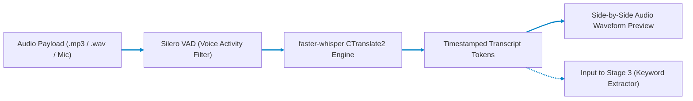

# Stage 2: Audio to Text (ASR) Engine

## Multilingual Automatic Speech Recognition for English, Hindi, & Bengali

Part of the **Nativox** AI Multilingual Dubbing Suite.

<!-- markdownlint-disable MD033 -->
<p align="center">
  <a href="../README.md"></a>
  <a href="../01_MP4_to_MP3/README.md"></a>
  <a href="../03_Text_to_Keyword/README.md"></a>
  <a href="../ARCHITECTURE.md"></a>
  <a href="https://python.org"></a>
  <a href="https://github.com/SYSTRAN/faster-whisper"></a>
</p>

---

## 📖 Operational Overview

Stage 2 handles automatic speech recognition (ASR) for the Nativox pipeline. It takes audio files (such as the MP3 generated by **Stage 1**) or direct microphone recordings, applies voice activity detection (VAD), and generates clean, timestamped transcriptions in **English**, **Hindi (Devanagari)**, and **Bengali (Bangla script)**.

The resulting transcript feeds directly into **Stage 3 (Salient Keyword Extraction)** and **Stage 5(b) (Sentence Reformation & Précis)**.

---

## 🛠️ Tech Stack: Architectural Rationale & Comparative Evaluation

| Technology | Purpose in Pipeline | Why It Is Chosen Over Existing Alternatives | Viable Alternatives & Trade-Off Analysis |
| :--- | :--- | :--- | :--- |
| **`faster-whisper` (CTranslate2)** | High-throughput multilingual speech transcription and automatic language identification | Up to 4x faster execution speed and uses 2x less RAM/VRAM than standard PyTorch Whisper via CTranslate2 INT8 quantization and customized fused kernels. 100% offline, zero cloud API recurring cost, zero vendor lock-in. | **OpenAI Whisper (Vanilla PyTorch):** 4x slower inference, larger memory requirements, lacks streaming VAD filter. <br>**Google Cloud STT / AWS Transcribe:** Expensive recurring pay-per-second cloud costs, network latency, and privacy compliance issues with sensitive audio. |
| **Silero VAD** | Deep-learning Voice Activity Detection preprocessing | Filters silent pauses, breathing sounds, and non-speech background noises before feeding frames to Whisper. Eliminates hallucinations and empty hallucinated subtitle loops common in pure Whisper on silence. | **WebRTC VAD:** Rule-based energy thresholding that fails on noisy speech, background music, or dynamic vocal ranges. |
| **FastAPI Backend** | Streaming ASR request coordinator, CORS gateway, and audio receiver | Provides asynchronous streaming support, non-blocking audio ingest, and auto-generated API specifications for seamless stage-to-stage orchestration. | **Flask:** Synchronous execution blocks during long transcription jobs unless coupled with Celery worker pools. |
| **Vanilla HTML5 / Web Audio API** | Real-time waveform rendering and interactive timestamp navigation | Allows instantaneous interactive seeking in the browser without framework overhead or third-party audio player bundle bloat. | **WaveSurfer.js / React-Player:** Introduces heavy client-side JavaScript dependencies and build pipelines. |

---

## 📋 Prerequisites & Requirements

- **Python:** **3.11** (Repository pinned via root `.python-version`)
- **Disk Space:** ~150 MB for default `base` or ~500 MB for `small` Whisper model weights (automatically downloaded on first execution to `~/.cache/huggingface/hub/`)

---

## 🚀 Setup & Execution

### 1. Navigate to Backend Directory

```bash
cd 02_MP3_to_Text/backend
```

### 2. Choose Your Setup Track

> [!IMPORTANT]
> **Must Use Python 3.11 (Avoid Python 3.14+):**
> Python 3.14 lacks pre-compiled C/Rust binary wheels for `faster-whisper`, `ctranslate2`, `av`, and `pydantic-core`. Running on Python 3.14 will cause `ModuleNotFoundError: No module named 'pydantic_core._pydantic_core'`.
> In PowerShell, never type `.\venv` alone (it is a directory); always run `.\venv\Scripts\Activate.ps1`.

---

#### Track 1 — Standard Python Setup (Requires Python 3.11)

Use this track if your default system `python` command is Python 3.11.

- **Windows PowerShell:**

  ```powershell
  python -m venv venv
  .\venv\Scripts\Activate.ps1
  pip install -r requirements.txt
  python -m uvicorn main:app --reload --port 8001
  ```

- **Windows Git Bash:**

  ```bash
  python -m venv venv
  source venv/Scripts/activate
  pip install -r requirements.txt
  python -m uvicorn main:app --reload --port 8001
  ```

- **macOS / Linux:**

  ```bash
  python3 -m venv venv
  source venv/bin/activate
  pip install -r requirements.txt
  python -m uvicorn main:app --reload --port 8001
  ```

---

#### Track 2 — Fast Setup with `uv` (Recommended)

Use this track for instant zero-configuration setup — `uv` automatically respects the repository's `.python-version` (3.11).

- **Windows PowerShell:**

  ```powershell
  uv venv --seed venv
  .\venv\Scripts\Activate.ps1
  pip install -r requirements.txt
  python -m uvicorn main:app --reload --port 8001
  ```

- **Windows Git Bash:**

  ```bash
  uv venv --seed venv
  source venv/Scripts/activate
  pip install -r requirements.txt
  python -m uvicorn main:app --reload --port 8001
  ```

- **macOS / Linux:**

  ```bash
  uv venv --seed venv
  source venv/bin/activate
  pip install -r requirements.txt
  python -m uvicorn main:app --reload --port 8001
  ```

The web interface will open at **`http://127.0.0.1:8001`**.

> [!IMPORTANT]
> **Access via `http://127.0.0.1:8001`, not raw `index.html`:**
> The FastAPI backend serves `frontend/index.html` directly on port `8001`. Opening `index.html` directly via `file:///` causes browser CORS errors that block requests to `/api/transcribe`.

---

## 🏛️ Pipeline Architecture



---

## 🔌 API Reference

### `POST /api/transcribe`

Transcribes uploaded audio files with automatic language identification.

- **Content-Type:** `multipart/form-data`
- **Request Body:** `file` (Binary Audio File)
- **Response Body:**

  ```json
  {
    "detected_language": "english",
    "language_probability": 0.985,
    "duration_seconds": 12.4,
    "segments": [
      {
        "id": 0,
        "start": 0.0,
        "end": 3.2,
        "text": " Welcome back to the Nativox demonstration.",
        "avg_logprob": -0.21
      }
    ]
  }
  ```

---

## 📁 Project Structure

```text
02_MP3_to_Text/
├── README.md               # Stage documentation
├── backend/
│   ├── main.py             # FastAPI routing and static file delivery
│   ├── requirements.txt    # faster-whisper, FastAPI, Uvicorn
│   └── app/
│       ├── config.py       # Model size selection and file upload limits
│       └── transcriber.py  # Model loader and inference wrapper with LRU caching
└── frontend/
    └── index.html          # Dual-column interactive audio and transcript interface
```

---

## 👥 Authors & Academic Context

- **Student Contributors:** Atanu Saha, Babin Bid, Rohit Kr Adak, Sagnik Bachhar
- **Faculty Guide:** Dr. Debjit Ghosh (Department of Computer Science & Engineering)
- **Suite:** Nativox Modular Real-Time AI Multilingual Dubbing Suite

---

<!-- markdownlint-disable MD033 -->
<p align="center">
  <a href="../README.md">🏠 Back to Suite Overview</a> &bull; <a href="../ARCHITECTURE.md">🏛️ Architecture</a> &bull; <a href="../INSTRUCTIONS.md">📖 Instructions</a> &bull; <a href="../ROADMAP.md">🗺️ Roadmap</a>
</p>

<p align="center">
  <sub><b>Nativox</b> &bull; Real-Time AI Multilingual Dubbing Suite &bull; <b>End of Module 2 Documentation</b></sub>
</p>
<!-- markdownlint-enable MD033 -->
