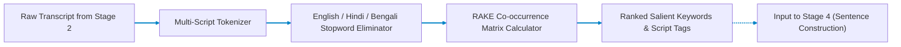

# Stage 3: Salient Keyword Extractor

## Multilingual RAKE & Cross-Script Salient Terminology Engine

Part of the **Nativox** AI Multilingual Dubbing Suite.

<!-- markdownlint-disable MD033 -->
<p align="center">
  <a href="../README.md"></a>
  <a href="../02_MP3_to_Text/README.md"></a>
  <a href="../04_Keyword_to_Sentence_Construction/README.md"></a>
  <a href="../ARCHITECTURE.md"></a>
  <a href="https://python.org"></a>
  <a href="https://fastapi.tiangolo.com"></a>
</p>

---

## 📖 Operational Overview

Stage 3 extracts salient, content-bearing domain terminology and named entities from transcripts generated in **Stage 2**. It supports text in **English**, **Hindi (Devanagari)**, **Bengali (Bangla script)**, and freely code-mixed speech without requiring heavy deep-learning model downloads.

The extracted keyword lexicon is transferred downstream to **Stage 4 (Keyword to Sentence Construction)** and **Stage 5 (Sentence Reformation & Translation)** to guide keyword retention and sentence reconstruction.

---

## 🛠️ Tech Stack: Architectural Rationale & Comparative Evaluation

| Technology | Purpose in Pipeline | Why It Is Chosen Over Existing Alternatives | Viable Alternatives & Trade-Off Analysis |
| :--- | :--- | :--- | :--- |
| **Multilingual RAKE Algorithm** | Unsupervised domain-agnostic key phrase and technical entity extraction | Zero-model, execution time < 5ms per transcript block. Works instantaneously on code-mixed utterances (English + Hindi + Bengali) using word graph co-occurrence degrees ($W_{\text{deg}} / W_{\text{freq}}$) without requiring multi-gigabyte neural checkpoints or GPU access. | **KeyBERT / spaCy / Transformer NER:** Requires 500MB–2GB BERT embeddings, adds 200ms–800ms inference latency per sentence, and frequently fails or crashes on mixed Indic Romanized/Devanagari code-switching. <br>**TF-IDF:** Requires an entire static reference corpus; cannot score single isolated transcripts accurately. |
| **Unicode Script Classifier** | Character-level script distribution and Indic balance metering | Inspects Unicode codepoints (`\u0900-\u097F` Devanagari, `\u0980-\u09FF` Bengali, `\u0000-\u007F` Latin) in $O(N)$ linear time with zero dependencies, giving instant visual composition metrics on the frontend. | **langdetect / fastText:** Probabilistic language identification libraries that require C-bindings or pre-trained models and are prone to misclassifying short 1-to-3 word technical keywords. |
| **FastAPI Backend (0.111.0)** | Asynchronous REST endpoint delivering ranked keyword sets and script scores | Native Pydantic validation handles transcript payloads reliably with sub-millisecond route dispatch and zero server latency overhead. | **Tornado / aiohttp:** Less ergonomic type validation and lacks automatic interactive OpenAPI documentation. |
| **Glassmorphic UI & SVG Chips** | Interactive visual representation of ranked keywords and script distribution | Provides instantaneous visual feedback on keyword salience and script density without client-side framework compilation. | **Streamlit:** Heavy Python-to-browser websocket polling, prone to state resetting and noticeable UI redraw latency. |

---

## 📋 Prerequisites & Requirements

- **Python:** **3.11** (Repository pinned via root `.python-version`)
- **Dependencies:** Lightweight pure-Python NLP routines (no GPU or model weight downloads required)

---

## 🚀 Setup & Execution

### 1. Navigate to Backend Directory

```bash
cd 03_Text_to_Keyword/backend
```

### 2. Create & Activate Virtual Environment

- **Create Environment (Python 3.11):**

  ```bash
  python -m venv venv
  ```

- **Activate on Windows (PowerShell):**

  ```powershell
  .\venv\Scripts\Activate.ps1
  ```

- **Activate on Windows (CMD):**

  ```cmd
  venv\Scripts\activate.bat
  ```

- **Activate on Windows (Git Bash):**

  ```bash
  source venv/Scripts/activate
  ```

- **Activate on macOS / Linux:**

  ```bash
  source venv/bin/activate
  ```

### 3. Install Dependencies & Launch Server

```bash
pip install -r requirements.txt
python -m uvicorn main:app --reload --port 8010
```

The web interface will open at **`http://127.0.0.1:8010`**.

> [!IMPORTANT]
> **Access via `http://127.0.0.1:8010`, not raw `index.html`:**
> The FastAPI backend serves `frontend/index.html` directly on port `8010`. Opening `index.html` directly via `file:///` causes browser CORS errors that block requests to `/api/keywords`.

---

## 🏛️ Pipeline Architecture



---

## 🔌 API Reference

### `POST /api/keywords`

Extracts ranked multi-word and single-word keywords from input text.

- **Content-Type:** `application/json`
- **Request Body:**

  ```json
  {
    "text": "In this tutorial we will train a neural network for computer vision applications.",
    "max_keywords": 8
  }
  ```

- **Response Body:**

  ```json
  {
    "total_keywords": 4,
    "keywords": [
      { "keyword": "computer vision applications", "score": 9.0 },
      { "keyword": "neural network", "score": 4.0 },
      { "keyword": "tutorial", "score": 1.0 },
      { "keyword": "train", "score": 1.0 }
    ],
    "script_distribution": {
      "en": 1.0,
      "hi": 0.0,
      "bn": 0.0
    },
    "dominant_script": "en",
    "script_labels": {
      "en": "English",
      "hi": "Hindi",
      "bn": "Bengali",
      "mixed": "Mixed"
    }
  }
  ```

---

## 📁 Project Structure

```text
03_Text_to_Keyword/
├── README.md                  # Stage documentation
├── backend/
│   ├── main.py                # FastAPI endpoints and static file routing
│   ├── requirements.txt       # FastAPI, Uvicorn, Pydantic
│   └── app/
│       ├── keyword_extractor.py # Multilingual RAKE co-occurrence engine
│       ├── language_utils.py    # Unicode-script tagging (Latin/Devanagari/Bengali)
│       └── stopwords.py         # Curated English, Hindi, and Bengali stopword sets
└── frontend/
    └── index.html             # Interactive text input, script meter, and keyword cards
```

---

## 👥 Authors & Academic Context

- **Student Contributors:** Atanu Saha, Babin Bid, Rohit Kr Adak, Sagnik Bachhar
- **Faculty Guide:** Dr. Debjit Ghosh (Department of Computer Science & Engineering)
- **Suite:** Nativox Modular Real-Time AI Multilingual Dubbing Suite

---

<!-- markdownlint-disable MD033 -->
<p align="center">
  <a href="../README.md">🏠 Back to Suite Overview</a> &bull; <a href="../ARCHITECTURE.md">🏛️ Architecture</a> &bull; <a href="../INSTRUCTIONS.md">📖 Instructions</a> &bull; <a href="../ROADMAP.md">🗺️ Roadmap</a>
</p>

<p align="center">
  <sub><b>Nativox</b> &bull; Real-Time AI Multilingual Dubbing Suite &bull; <b>End of Module 3 Documentation</b></sub>
</p>
<!-- markdownlint-enable MD033 -->
