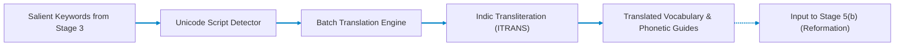

# Stage 5(a): Contextual Keyword Translation (Sagnik)

## Cross-Lingual Terminology Mapping & Phonetic Pronunciation Guide

Part of the **Nativox** AI Multilingual Dubbing Suite.

[](../README.md)
[](../03_Text_to_Keyword/README.md)
[:_Reformation-FF6B6B?style=for-the-badge&logo=fastapi&logoColor=white)](../05b_Sentence_Reformation__Atanu/README.md)
[](../ARCHITECTURE.md)
[](https://python.org)
[](https://fastapi.tiangolo.com)

---

## 📖 Operational Overview

Stage 5(a) is the multilingual translation and transliteration bridge of the Nativox pipeline. It takes the domain terminology and keyword clusters extracted in **Stage 3** and translates them into the target language (**English**, **Hindi**, or **Bengali**) while preserving context, technical precision, and original token sequence.

It also generates Romanized phonetic pronunciation guides (transliterations) to assist speech synthesis in downstream stages.

The translated vocabulary is provided to **Stage 5(b) (Sentence Reformation & Précis)** to ensure domain terms are accurately preserved during sentence reconstruction.

---

## 🛠️ Tech Stack & Key Features

- **Backend:** FastAPI (Python 3.11 asynchronous server)
- **Translation Services:** `deep-translator` with multi-engine fallback resilience
- **Phonetic Transliteration:** `indic-transliteration` (ITRANS / Harvard-Kyoto scheme for Devanagari and Bengali scripts)
- **Script Detection:** High-speed Unicode block inspection (Devanagari $\to$ Hindi, Bengali $\to$ Bengali, Basic Latin $\to$ English) without heavy model overhead
- **Frontend:** Single-page reactive dashboard with script detection tags and phonetic pronunciation badges

---

## 📋 Prerequisites & Requirements

- **Python:** **3.11** (Repository pinned via root `.python-version`)
- **Internet Access:** Required for translation API requests
- **Dependencies:** `fastapi`, `uvicorn`, `deep-translator`, `indic-transliteration`, `pydantic`

---

## 🚀 Setup & Execution

### 1. Navigate to Backend Directory

```bash
cd 05a_Keyword_Translation__Sagnik/backend
```

### 2. Create & Activate Virtual Environment

- **Create Environment (Python 3.11):**

  ```bash
  python -m venv venv
  ```

- **Activate on Windows (PowerShell):**

  ```powershell
  .\venv\Scripts\Activate.ps1
  ```

- **Activate on Windows (CMD):**

  ```cmd
  venv\Scripts\activate.bat
  ```

- **Activate on macOS / Linux / Git Bash:**

  ```bash
  source venv/bin/activate
  ```

### 3. Install Dependencies & Launch Server

```bash
pip install -r requirements.txt
python -m uvicorn main:app --reload --port 8011
```

The web interface will be available at: **`http://127.0.0.1:8011`**

> [!IMPORTANT]
> **Access via `http://127.0.0.1:8011`, not raw `index.html`:**
> The FastAPI backend serves `frontend/index.html` directly on port `8011`. Opening `index.html` directly via local `file:///` causes browser CORS errors that block requests to `/api/translate-batch`.

---

## 🏛️ Pipeline Architecture



---

## 🔌 API Reference

### `POST /api/translate-batch`

Translates an array of multilingual keywords into the specified target language.

- **Content-Type:** `application/json`
- **Request Body:**

  ```json
  {
    "keywords": ["water", "कंप्यूटर", "বই", "neural network"],
    "target_language": "hindi"
  }
  ```

- **Response Body:**

  ```json
  {
    "target_language": "hindi",
    "target_label": "Hindi",
    "results": [
      {
        "original": "water",
        "detected_language": "english",
        "detected_label": "English",
        "translated_text": "पानी",
        "target_language": "hindi",
        "target_label": "Hindi",
        "pronunciation": "pani"
      },
      {
        "original": "neural network",
        "detected_language": "english",
        "detected_label": "English",
        "translated_text": "न्यूरल नेटवर्क",
        "target_language": "hindi",
        "target_label": "Hindi",
        "pronunciation": "nyurala netavarka"
      }
    ]
  }
  ```

---

## 📁 Project Structure

```text
05a_Keyword_Translation__Sagnik/
├── README.md                  # Stage documentation
├── backend/
│   ├── main.py                # FastAPI REST endpoints & static server
│   ├── requirements.txt       # deep-translator, indic-transliteration, fastapi
│   └── app/
│       ├── translate_service.py # Batch translation handler with error fallback
│       └── detect.py          # Fast Unicode block script detector
└── frontend/
    └── index.html             # Interactive UI with phonetic badge cards
```

---

## 👥 Authors & Academic Context

- **Student Contributors:** Atanu Saha, Babin Bid, Rohit Kr Adak, Sagnik Bachhar
- **Faculty Guide:** Dr. Debjit Ghosh (Department of Computer Science & Engineering)
- **Suite:** Nativox Modular Real-Time AI Multilingual Dubbing Suite

---

<!-- markdownlint-disable MD033 -->
<p align="center">
  <a href="../README.md">🏠 Back to Suite Overview</a> &bull; <a href="../ARCHITECTURE.md">🏛️ Architecture</a> &bull; <a href="../INSTRUCTIONS.md">📖 Instructions</a> &bull; <a href="../ROADMAP.md">🗺️ Roadmap</a>
</p>

<p align="center">
  <sub><b>Nativox</b> &bull; Real-Time AI Multilingual Dubbing Suite &bull; <b>End of Module 5(a) Documentation</b></sub>
</p>
<!-- markdownlint-enable MD033 -->
