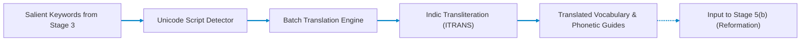

# Stage 5(a): Contextual Keyword Translation (Sagnik)

## Cross-Lingual Terminology Mapping & Phonetic Pronunciation Guide

Part of the **Nativox** AI Multilingual Dubbing Suite.

<!-- markdownlint-disable MD033 -->
<p align="center">
  <a href="../README.md"></a>
  <a href="../03_Text_to_Keyword/README.md"></a>
  <a href="../05b_Sentence_Reformation__Atanu/README.md"></a>
  <a href="../ARCHITECTURE.md"></a>
  <a href="https://python.org"></a>
  <a href="https://fastapi.tiangolo.com"></a>
</p>

---

## 📖 Operational Overview

Stage 5(a) is the multilingual translation and transliteration bridge of the Nativox pipeline. It takes the domain terminology and keyword clusters extracted in **Stage 3** and translates them into the target language (**English**, **Hindi**, or **Bengali**) while preserving context, technical precision, and original token sequence.

It also generates Romanized phonetic pronunciation guides (transliterations) to assist speech synthesis in downstream stages.

The translated vocabulary is provided to **Stage 5(b) (Sentence Reformation & Précis)** to ensure domain terms are accurately preserved during sentence reconstruction.

---

## 🛠️ Tech Stack & Architectural Justification

| Technology | Purpose in Pipeline | Why It Is Chosen Over Existing Alternatives | Viable Alternatives & Trade-Off Analysis |
| :--- | :--- | :--- | :--- |
| **FastAPI + Uvicorn** | High-concurrency async REST API handling real-time keyword list translation and transliteration queries. | Asynchronous event loop (`async`/`await`) natively dispatches parallel HTTP queries to translation gateways without worker thread contention. OpenAPI autodocs facilitate frontend-backend integration. | **Flask**: Synchronous blocking architecture limits throughput during concurrent external translation calls.<br>**Django**: Massive monolith with unnecessary ORM and session overhead for an isolated translation microservice. |
| **`deep-translator`** | Multi-engine abstraction layer executing contextual neural translation across English, Hindi, and Bengali. | Lightweight, unified interface providing seamless failover across engines (Google Translate, LibreTranslate, DeepL, MyMemory) without proprietary billing keys or 5 GB local PyTorch models. | **Official Google Cloud Translation API**: Requires enterprise GCP project setup, billing keys, and per-character fees.<br>**Helsinki-NLP MarianMT**: Requires heavy PyTorch checkpoints (>1 GB per language pair) and high RAM usage.<br>**IndicTrans2**: State-of-the-art for Indic languages, but requires 4–8 GB GPU VRAM and complex CPython dependencies, whereas `deep-translator` runs instantly on lightweight machines. |
| **`indic-transliteration`** | Generates deterministic Romanized phonetic pronunciation guides using standard Indic schemes (ITRANS / Harvard-Kyoto). | Converts complex Devanagari and Bengali conjunct ligatures into exact Roman phonetic equivalents, ensuring downstream TTS phoneme aligners pronounce vernacular terms properly without accents getting dropped. | **`epitran`**: Phoneme extraction is unmaintained for Bengali dialect edge cases and has heavy Flite/C++ dependencies.<br>**Custom regex transliterators**: Fail on complex vowel matras, halants, and conjunct clusters (e.g., क्ष, জ্ঞ) across Devanagari and Bengali. |
| **Unicode Block Script Inspector** | Zero-latency language and script detection (Basic Latin $\to$ English, Devanagari $\to$ Hindi, Bengali $\to$ Bengali). | Inspects character Unicode codepoint ranges (`\u0900`–`\u097F`, `\u0980`–`\u09FF`) in $\mathcal{O}(N)$ CPU time with 0 MB memory footprint and zero model inference overhead. | **`langdetect` / `fastText`**: Statistical n-gram models can misclassify short 1–2 word technical terms or require loading large language model vectors. |
| **Vanilla HTML5 / CSS3 / JS UI** | Interactive browser workbench displaying source terms, translated targets, script badges, and pronunciation chips. | Zero npm dependencies, instantaneous load time, and transparent JSON fetching via browser-native `fetch()`. | **React / Vue**: Introduces heavy node_modules build pipelines, bundle fragmentation, and SSR overhead for a single-page translation testing view. |

---

## 📋 Prerequisites & Requirements

- **Python:** **3.11** (Repository pinned via root `.python-version`)
- **Internet Access:** Required for translation API requests
- **Dependencies:** `fastapi`, `uvicorn`, `deep-translator`, `indic-transliteration`, `pydantic`

---

## 🚀 Setup & Execution

### 1. Navigate to Backend Directory

```bash
cd 05a_Keyword_Translation__Sagnik/backend
```

### 2. Create & Activate Virtual Environment

- **Create Environment (Python 3.11):**

  ```bash
  python -m venv venv
  ```

- **Activate on Windows (PowerShell):**

  ```powershell
  .\venv\Scripts\Activate.ps1
  ```

- **Activate on Windows (CMD):**

  ```cmd
  venv\Scripts\activate.bat
  ```

- **Activate on Windows (Git Bash):**

  ```bash
  source venv/Scripts/activate
  ```

- **Activate on macOS / Linux:**

  ```bash
  source venv/bin/activate
  ```

### 3. Install Dependencies & Launch Server

```bash
pip install -r requirements.txt
python -m uvicorn main:app --reload --port 8011
```

The web interface will be available at: **`http://127.0.0.1:8011`**

> [!IMPORTANT]
> **Access via `http://127.0.0.1:8011`, not raw `index.html`:**
> The FastAPI backend serves `frontend/index.html` directly on port `8011`. Opening `index.html` directly via local `file:///` causes browser CORS errors that block requests to `/api/translate-batch`.

---

## 🏛️ Pipeline Architecture



---

## 🔌 API Reference

### `POST /api/translate-batch`

Translates an array of multilingual keywords into the specified target language.

- **Content-Type:** `application/json`
- **Request Body:**

  ```json
  {
    "keywords": ["water", "कंप्यूटर", "বই", "neural network"],
    "target_language": "hindi"
  }
  ```

- **Response Body:**

  ```json
  {
    "target_language": "hindi",
    "target_label": "Hindi",
    "results": [
      {
        "original": "water",
        "detected_language": "english",
        "detected_label": "English",
        "translated_text": "पानी",
        "target_language": "hindi",
        "target_label": "Hindi",
        "pronunciation": "pani"
      },
      {
        "original": "neural network",
        "detected_language": "english",
        "detected_label": "English",
        "translated_text": "न्यूरल नेटवर्क",
        "target_language": "hindi",
        "target_label": "Hindi",
        "pronunciation": "nyurala netavarka"
      }
    ]
  }
  ```

---

## 📁 Project Structure

```text
05a_Keyword_Translation__Sagnik/
├── README.md                  # Stage documentation
├── backend/
│   ├── main.py                # FastAPI REST endpoints & static server
│   ├── requirements.txt       # deep-translator, indic-transliteration, fastapi
│   └── app/
│       ├── translate_service.py # Batch translation handler with error fallback
│       └── detect.py          # Fast Unicode block script detector
└── frontend/
    └── index.html             # Interactive UI with phonetic badge cards
```

---

## 👥 Authors & Academic Context

- **Student Contributors:** Atanu Saha, Babin Bid, Rohit Kr Adak, Sagnik Bachhar
- **Faculty Guide:** Dr. Debjit Ghosh (Department of Computer Science & Engineering)
- **Suite:** Nativox Modular Real-Time AI Multilingual Dubbing Suite

---

<!-- markdownlint-disable MD033 -->
<p align="center">
  <a href="../README.md">🏠 Back to Suite Overview</a> &bull; <a href="../ARCHITECTURE.md">🏛️ Architecture</a> &bull; <a href="../INSTRUCTIONS.md">📖 Instructions</a> &bull; <a href="../ROADMAP.md">🗺️ Roadmap</a>
</p>

<p align="center">
  <sub><b>Nativox</b> &bull; Real-Time AI Multilingual Dubbing Suite &bull; <b>End of Module 5(a) Documentation</b></sub>
</p>
<!-- markdownlint-enable MD033 -->
