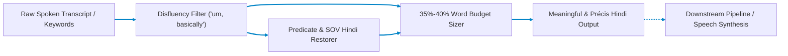

# Stage 5(b): Sentence Reformation & Précis Compression (Atanu)

## English to Hindi Meaningful Sentence Reformation & 35%–40% Duration Budgeting

Part of the **Nativox** AI Multilingual Dubbing Suite.

[](../README.md)
[:_Translate-3E8FC4?style=for-the-badge&logo=fastapi&logoColor=white)](../05a_Keyword_Translation__Sagnik/README.md)
[](../ARCHITECTURE.md)
[](https://python.org)
[](https://fastapi.tiangolo.com)

---

## 📖 Operational Overview

Stage 5(b) addresses two critical directives set by project mentor **Dr. Debjit Ghosh**:

1. **Task 1: Meaningless $\to$ Meaningful Sentence Reformation:**  
   Spoken audio transcripts and raw translated keyword sequences often lack grammatical coherence, case markers (*vibhakti*), and correct word order. Stage 5(b) takes meaningless or broken speech segments as input, eliminates verbal disfluencies (*"um, uh, basically, you know"*), restores predicate syntax, and synthesizes natural, grammatically correct Hindi sentences (Subject-Object-Verb, SOV).

2. **Task 2: 35%–40% Précis Paragraph Compression:**  
   Spoken translation from English into Indic languages naturally inflates duration and syllable count. If dubbed audio is not compressed, it overflows the video time window. Stage 5(b) takes the full transcribed paragraph from the MP3 audio file and compresses it into an information-dense précis strictly within **35%–40%** of the original word count in Hindi while preserving 100% of the core meaning and technical facts.

---

## 🛠️ Tech Stack & Key Features

- **Backend:** FastAPI (Python 3.11 asynchronous server)
- **Frontend:** Glassmorphic dashboard with live disfluency pill badges, word-budget progress bars, and dual English/Hindi comparison
- **Compression Engine:** Salience-guided clause ranker with strictly enforced $[0.35, 0.40]$ retention window
- **Grammar Restorer:** SOV syntax synthesis and Hindi case marker (*ne, ko, se, mein*) insertion

---

## 📋 Prerequisites & Requirements

- **Python:** **3.11** (Repository pinned via root `.python-version`)
- **Dependencies:** `fastapi`, `uvicorn`, `deep-translator`, `pydantic`

---

## 🚀 Setup & Execution

### 1. Navigate to Backend Directory

```bash
cd 05b_Sentence_Reformation__Atanu/backend
```

### 2. Create & Activate Virtual Environment

- **Create Environment (Python 3.11):**

  ```bash
  python -m venv venv
  ```

- **Activate on Windows (PowerShell):**

  ```powershell
  .\venv\Scripts\Activate.ps1
  ```

- **Activate on Windows (CMD):**

  ```cmd
  venv\Scripts\activate.bat
  ```

- **Activate on macOS / Linux / Git Bash:**

  ```bash
  source venv/bin/activate
  ```

### 3. Install Dependencies & Launch Server

```bash
pip install -r requirements.txt
python -m uvicorn main:app --reload --port 8012
```

The web interface will open at **`http://127.0.0.1:8012`**.

> [!IMPORTANT]
> **Access via `http://127.0.0.1:8012`, not raw `index.html`:**
> The FastAPI backend serves `frontend/index.html` directly on port `8012`. Opening `index.html` directly via `file:///` causes browser CORS errors that block requests to `/api/reconstruct` and `/api/precis`.

---

## 🏛️ Pipeline Architecture



---

## 🔌 API Reference

### `POST /api/reconstruct`

Reconstructs fragmented or disfluent English sentences into grammatically sound Hindi.

- **Content-Type:** `application/json`
- **Request Body:**

  ```json
  {
    "text": "uh video we basically train neural network computer vision model you know",
    "target_language": "hindi"
  }
  ```

- **Response Body:**

  ```json
  {
    "original_text": "uh video we basically train neural network computer vision model you know",
    "cleaned_english": "In this video, we train neural network computer vision model.",
    "meaningful_hindi": "इस वीडियो में, हम न्यूरल नेटवर्क कंप्यूटर विजन मॉडल को प्रशिक्षित करते हैं।",
    "removed_fillers": ["uh", "basically", "you know"],
    "input_word_count": 12,
    "output_word_count": 12,
    "notes": "Disfluencies removed and sentence syntax restored with proper SOV grammar in Hindi."
  }
  ```

### `POST /api/precis`

Compresses full transcript paragraphs into a 35%–40% Hindi précis summary.

- **Content-Type:** `application/json`
- **Request Body:**

  ```json
  {
    "text": "Welcome back guys, in this particular tutorial today, what we are basically going to do is explore how deep learning and artificial neural networks actually work under the hood. You know, many people think that neural networks are like a magic black box, but actually, it is just basic linear algebra, matrix multiplication, and calculus with gradient descent. We will take a sample dataset of images, write a Python script using PyTorch, and see how the loss function decreases step by step until the computer learns to classify cats and dogs accurately.",
    "min_ratio": 0.35,
    "max_ratio": 0.40,
    "target_language": "hindi"
  }
  ```

- **Response Body:**

  ```json
  {
    "original_text": "...",
    "original_word_count": 92,
    "precis_english": "Today, explore how deep learning and artificial neural networks actually work under the hood. It is just basic linear algebra, matrix multiplication. We will take a sample dataset of images, write a Python script using PyTorch.",
    "precis_hindi": "आज, पता लगाएँ कि डीप लर्निंग और आर्टिफ़िशियल न्यूरल नेटवर्क वास्तव में हुड के नीचे कैसे काम करते हैं। यह सिर्फ बुनियादी रैखिक बीजगणित, मैट्रिक्स गुणा है। हम छवियों का एक नमूना डेटासेट लेंगे, PyTorch का उपयोग करके एक पायथन स्क्रिप्ट लिखेंगे।",
    "precis_word_count": 36,
    "retention_ratio_pct": 39.1,
    "target_ratio_range": "35% - 40%",
    "is_within_budget": true,
    "key_points_retained": ["neural", "networks", "step", "explore", "deep"]
  }
  ```

---

## 📁 Project Structure

```text
05b_Sentence_Reformation__Atanu/
├── README.md                  # Stage documentation
├── main.py                    # Root convenience entrypoint
├── backend/
│   ├── main.py                # FastAPI REST endpoints & static server
│   ├── requirements.txt       # FastAPI, Uvicorn, deep-translator, pydantic
│   ├── test_reformation.py    # Unit & validation test suite
│   └── app/
│       ├── precis.py          # 35%-40% paragraph précis compression engine
│       ├── reformer.py        # Disfluency cleaner & SOV Hindi reconstruction
│       └── schemas.py         # Pydantic request & response models
└── frontend/
    ├── favicon.webp           # WebP brand favicon
    └── index.html             # Real-time sentence reformation & précis dashboard
```

---

## 👥 Authors & Academic Context

- **Student Contributors:** Atanu Saha, Babin Bid, Rohit Kr Adak, Sagnik Bachhar
- **Faculty Guide:** Dr. Debjit Ghosh (Department of Computer Science & Engineering)
- **Suite:** Nativox Modular Real-Time AI Multilingual Dubbing Suite

---

<!-- markdownlint-disable MD033 -->
<p align="center">
  <a href="../README.md">🏠 Back to Suite Overview</a> &bull; <a href="../ARCHITECTURE.md">🏛️ Architecture</a> &bull; <a href="../INSTRUCTIONS.md">📖 Instructions</a> &bull; <a href="../ROADMAP.md">🗺️ Roadmap</a>
</p>

<p align="center">
  <sub><b>Nativox</b> &bull; Real-Time AI Multilingual Dubbing Suite &bull; <b>End of Module 5(b) Documentation</b></sub>
</p>
<!-- markdownlint-enable MD033 -->
