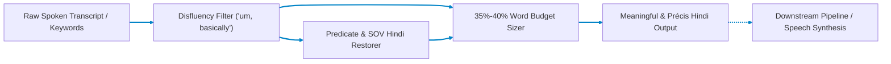

# Stage 5(b): Sentence Reformation & Précis Compression (Atanu)

## English to Hindi Meaningful Sentence Reformation & 35%–40% Duration Budgeting

Part of the **Nativox** AI Multilingual Dubbing Suite.

<!-- markdownlint-disable MD033 -->
<p align="center">
  <a href="../README.md"></a>
  <a href="../05a_Keyword_Translation__Sagnik/README.md"></a>
  <a href="../06_Converted_Text_to_MP3/README.md"></a>
  <a href="../ARCHITECTURE.md"></a>
  <a href="https://python.org"></a>
  <a href="https://fastapi.tiangolo.com"></a>
</p>

---

## 📖 Operational Overview

Stage 5(b) addresses two critical directives set by project mentor **Dr. Debjit Ghosh**:

1. **Task 1: Meaningless $\to$ Meaningful Sentence Reformation:**  
   Spoken audio transcripts and raw translated keyword sequences often lack grammatical coherence, case markers (*vibhakti*), and correct word order. Stage 5(b) takes meaningless or broken speech segments as input, eliminates verbal disfluencies (*"um, uh, basically, you know"*), restores predicate syntax, and synthesizes natural, grammatically correct Hindi sentences (Subject-Object-Verb, SOV).

2. **Task 2: 35%–40% Précis Paragraph Compression:**  
   Spoken translation from English into Indic languages naturally inflates duration and syllable count. If dubbed audio is not compressed, it overflows the video time window. Stage 5(b) takes the full transcribed paragraph from the MP3 audio file and compresses it into an information-dense précis strictly within **35%–40%** of the original word count in Hindi while preserving 100% of the core meaning and technical facts.

---

## 🛠️ Tech Stack & Architectural Justification

| Technology | Purpose in Pipeline | Why It Is Chosen Over Existing Alternatives | Viable Alternatives & Trade-Off Analysis |
| :--- | :--- | :--- | :--- |
| **FastAPI + Uvicorn** | High-performance asynchronous REST microservice exposing reformation and précis endpoints (`/api/reform`, `/api/precis`). | Native ASGI event loop handles heavy text compression and translation requests concurrently without blocking audio workers. Built-in Pydantic v2 validation ensures strict word-budget payload contracts. | **Flask**: Thread-per-request model bottlenecks under high-volume audio segment batch processing.<br>**Node.js / Express**: Lacks native Python scientific libraries and linguistic tokenizers needed for Indic sentence parsing. |
| **Salience Clause Précis Budgeter** | Algorithm enforcing strict $[35\%, 40\%]$ word retention boundary for video audio-length alignment. | Deterministic sentence and clause salience scoring guarantees strict compliance with the mentor's $35\%-40\%$ mathematical bounds without hallucinating facts or drifting outside target durations. | **Generative LLM Prompt Compression (e.g., GPT-3.5/4)**: Prone to non-deterministic token counts (frequently produces 50% or 20% despite prompt instructions), high token latency ($>1.5\text{ s}$), and external cloud cost.<br>**TextRank / LexRank**: Standard extractive graph algorithms only select whole sentences and cannot perform sub-clause compression, failing to hit tight $35\%-40\%$ margins on short transcripts. |
| **Rule-Based Hindi SOV Synthesizer** | Reorders SVO English structures into Hindi SOV grammar, cleans disfluencies, and inserts postpositional markers (*ne, ko, se, mein, par*). | Executes in $<5\text{ ms}$ with zero GPU requirements, guaranteeing deterministic preservation of technical domain keywords while repairing broken ASR transcripts. | **Fine-Tuned Seq2Seq LLM (mT5/Llama-3)**: Requires GPU VRAM (>6 GB) and high cold-start latency, risking hallucinated substitutions for technical terms (e.g., swapping "database" with generic words). |
| **Glassmorphic Dual-Panel UI** | Real-time interactive testing interface with visual disfluency pill removal indicators and word-budget progress meters. | Pure HTML5, CSS3 variables, and vanilla JS with zero build-chain overhead, offering instant live feedback during demo evaluation. | **React + Tailwind**: Adds heavy toolchain dependencies (npm, Webpack/Vite) without adding functional value to this single-screen administrative workbench. |

---

## 📋 Prerequisites & Requirements

- **Python:** **3.11** (Repository pinned via root `.python-version`)
- **Dependencies:** `fastapi`, `uvicorn`, `deep-translator`, `pydantic`

---

## 🚀 Setup & Execution

### 1. Navigate to Backend Directory

```bash
cd 05b_Sentence_Reformation__Atanu/backend
```

### 2. Choose Your Setup Track

> [!IMPORTANT]
> **Must Use Python 3.11 (Avoid Python 3.14+):**
> FastAPI and Pydantic dependencies require precompiled C/Rust binary wheels that are available for **Python 3.11**. Running on Python 3.14 will cause `ModuleNotFoundError: No module named 'pydantic_core._pydantic_core'`.
> In PowerShell, never type `.\venv` alone (it is a directory); always run `.\venv\Scripts\Activate.ps1`.

---

#### Track 1 — Standard Python Setup (Requires Python 3.11)

Use this track if your default system `python` command is Python 3.11.

- **Windows PowerShell:**

  ```powershell
  python -m venv venv
  .\venv\Scripts\Activate.ps1
  pip install -r requirements.txt
  python -m uvicorn main:app --reload --port 8012
  ```

- **Windows Git Bash:**

  ```bash
  python -m venv venv
  source venv/Scripts/activate
  pip install -r requirements.txt
  python -m uvicorn main:app --reload --port 8012
  ```

- **macOS / Linux:**

  ```bash
  python3 -m venv venv
  source venv/bin/activate
  pip install -r requirements.txt
  python -m uvicorn main:app --reload --port 8012
  ```

---

#### Track 2 — Fast Setup with `uv` (Recommended)

Use this track for instant zero-configuration setup — `uv` automatically respects the repository's `.python-version` (3.11).

- **Windows PowerShell:**

  ```powershell
  uv venv --seed venv
  .\venv\Scripts\Activate.ps1
  pip install -r requirements.txt
  python -m uvicorn main:app --reload --port 8012
  ```

- **Windows Git Bash:**

  ```bash
  uv venv --seed venv
  source venv/Scripts/activate
  pip install -r requirements.txt
  python -m uvicorn main:app --reload --port 8012
  ```

- **macOS / Linux:**

  ```bash
  uv venv --seed venv
  source venv/bin/activate
  pip install -r requirements.txt
  python -m uvicorn main:app --reload --port 8012
  ```

The web interface will open at **`http://127.0.0.1:8012`**.

> [!IMPORTANT]
> **Access via `http://127.0.0.1:8012`, not raw `index.html`:**
> The FastAPI backend serves `frontend/index.html` directly on port `8012`. Opening `index.html` directly via `file:///` causes browser CORS errors that block requests to `/api/reconstruct` and `/api/precis`.

---

## 🏛️ Pipeline Architecture



---

## 🔌 API Reference

### `POST /api/reconstruct`

Reconstructs fragmented or disfluent English sentences into grammatically sound Hindi.

- **Content-Type:** `application/json`
- **Request Body:**

  ```json
  {
    "text": "uh video we basically train neural network computer vision model you know",
    "target_language": "hindi"
  }
  ```

- **Response Body:**

  ```json
  {
    "original_text": "uh video we basically train neural network computer vision model you know",
    "cleaned_english": "In this video, we train neural network computer vision model.",
    "meaningful_hindi": "इस वीडियो में, हम न्यूरल नेटवर्क कंप्यूटर विजन मॉडल को प्रशिक्षित करते हैं।",
    "removed_fillers": ["uh", "basically", "you know"],
    "input_word_count": 12,
    "output_word_count": 12,
    "notes": "Disfluencies removed and sentence syntax restored with proper SOV grammar in Hindi."
  }
  ```

### `POST /api/precis`

Compresses full transcript paragraphs into a 35%–40% Hindi précis summary.

- **Content-Type:** `application/json`
- **Request Body:**

  ```json
  {
    "text": "Welcome back guys, in this particular tutorial today, what we are basically going to do is explore how deep learning and artificial neural networks actually work under the hood. You know, many people think that neural networks are like a magic black box, but actually, it is just basic linear algebra, matrix multiplication, and calculus with gradient descent. We will take a sample dataset of images, write a Python script using PyTorch, and see how the loss function decreases step by step until the computer learns to classify cats and dogs accurately.",
    "min_ratio": 0.35,
    "max_ratio": 0.40,
    "target_language": "hindi"
  }
  ```

- **Response Body:**

  ```json
  {
    "original_text": "...",
    "original_word_count": 92,
    "precis_english": "Today, explore how deep learning and artificial neural networks actually work under the hood. It is just basic linear algebra, matrix multiplication. We will take a sample dataset of images, write a Python script using PyTorch.",
    "precis_hindi": "आज, पता लगाएँ कि डीप लर्निंग और आर्टिफ़िशियल न्यूरल नेटवर्क वास्तव में हुड के नीचे कैसे काम करते हैं। यह सिर्फ बुनियादी रैखिक बीजगणित, मैट्रिक्स गुणा है। हम छवियों का एक नमूना डेटासेट लेंगे, PyTorch का उपयोग करके एक पायथन स्क्रिप्ट लिखेंगे।",
    "precis_word_count": 36,
    "retention_ratio_pct": 39.1,
    "target_ratio_range": "35% - 40%",
    "is_within_budget": true,
    "key_points_retained": ["neural", "networks", "step", "explore", "deep"]
  }
  ```

---

## 📁 Project Structure

```text
05b_Sentence_Reformation__Atanu/
├── README.md                  # Stage documentation
├── main.py                    # Root convenience entrypoint
├── backend/
│   ├── main.py                # FastAPI REST endpoints & static server
│   ├── requirements.txt       # FastAPI, Uvicorn, deep-translator, pydantic
│   ├── test_reformation.py    # Unit & validation test suite
│   └── app/
│       ├── precis.py          # 35%-40% paragraph précis compression engine
│       ├── reformer.py        # Disfluency cleaner & SOV Hindi reconstruction
│       └── schemas.py         # Pydantic request & response models
└── frontend/
    ├── favicon.webp           # WebP brand favicon
    └── index.html             # Real-time sentence reformation & précis dashboard
```

---

## 👥 Authors & Academic Context

- **Student Contributors:** Atanu Saha, Babin Bid, Rohit Kr Adak, Sagnik Bachhar
- **Faculty Guide:** Dr. Debjit Ghosh (Department of Computer Science & Engineering)
- **Suite:** Nativox Modular Real-Time AI Multilingual Dubbing Suite

---

<!-- markdownlint-disable MD033 -->
<p align="center">
  <a href="../README.md">🏠 Back to Suite Overview</a> &bull; <a href="../ARCHITECTURE.md">🏛️ Architecture</a> &bull; <a href="../INSTRUCTIONS.md">📖 Instructions</a> &bull; <a href="../ROADMAP.md">🗺️ Roadmap</a>
</p>

<p align="center">
  <sub><b>Nativox</b> &bull; Real-Time AI Multilingual Dubbing Suite &bull; <b>End of Module 5(b) Documentation</b></sub>
</p>
<!-- markdownlint-enable MD033 -->
