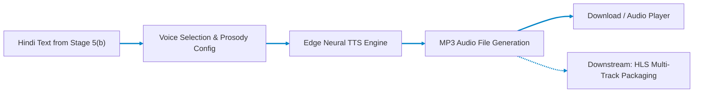
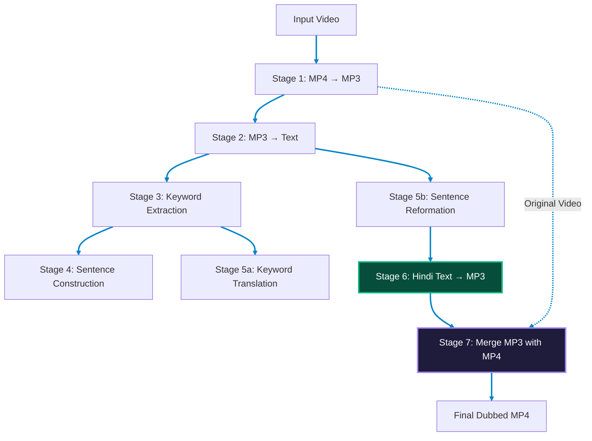

# Stage 6: Text → MP3 Speech Synthesis

## Neural TTS Voice Generation for the Nativox Pipeline

Part of the **Nativox** AI Multilingual Dubbing Suite.

<!-- markdownlint-disable MD033 -->
<p align="center">
  <a href="../README.md"></a>
  <a href="../05b_Sentence_Reformation__Atanu/README.md"></a>
  <a href="../07_Merge_MP3_with_MP4/README.md"></a>
  <a href="../ARCHITECTURE.md"></a>
  <a href="https://python.org"></a>
  <a href="https://fastapi.tiangolo.com"></a>
</p>

---

## 📖 Operational Overview

Stage 6 is the **final output stage** of the Nativox pipeline. It takes reformed target text (**Hindi** text from Stage 5(b) or **Bengali**) and synthesizes it into natural-sounding speech as a downloadable MP3 file using **Microsoft Edge Neural TTS** voices.

This stage closes the complete dubbing loop:

> `English Video` → `Audio` → `Text` → `Keywords` → `Sentences` → `Translation` → `Reformation` → `Dubbed Speech MP3 (Hindi / Bengali)`

### Key Capabilities

1. **Target Dubbed Speech Synthesis:** Converts **Hindi** and **Bengali** text into studio-quality speech using `edge-tts` (Microsoft Edge Neural Voices) — no API key, no GPU required.
2. **Language Validation & Script Gating:** Automatically inspects input text to verify it is in target dubbed scripts (Devanagari for Hindi, Bangla script for Bengali), rejecting raw English source text so users translate via Stage 5 first.
3. **Multi-Voice Selection:** Dedicated neural voices across both target languages:
   - **Hindi (`hi-IN`):** Swara (Female), Madhur (Male)
   - **Bengali (`bn-IN`, `bn-BD`):** Bashkar (Male), Tanishaa (Female), Nabanita (Female), Pradeep (Male)
4. **Prosody Control:** Adjust speech rate and pitch to match the original video's pacing and tone.
5. **Pipeline Integration:** Accepts direct output from Stage 5(b) (reformed Hindi sentences and précis) and produces the final dubbed audio track.

---

## 🛠️ Tech Stack & Architectural Justification

| Technology | Purpose in Pipeline | Why It Is Chosen Over Existing Alternatives | Viable Alternatives & Trade-Off Analysis |
| :--- | :--- | :--- | :--- |
| **FastAPI + Uvicorn** | Asynchronous streaming REST API serving synthesized MP3 audio buffers (`/api/synthesize`) and voice manifests (`/api/voices`). | Native `async`/`await` architecture interfaces seamlessly with `edge_tts.Communicate.save()` without blocking system worker threads. Provides built-in Swagger/OpenAPI documentation. | **Flask**: Synchronous blocking architecture requires WSGI thread pools (e.g., Gunicorn gevent) that stall during long neural TTS streaming sessions.<br>**Express.js**: Requires external Node child processes to run Python NLP validation scripts. |
| **`edge-tts` (Microsoft Edge Neural Voices)** | High-fidelity neural voice synthesis for Hindi and Bengali with prosody, pitch, and rate control. | Produces state-of-the-art studio-quality natural human cadence without requiring expensive cloud subscriptions, API keys, or multi-gigabyte local GPU VRAM. Native support for Bengali regional dialects (`bn-IN`, `bn-BD`). | **Google Cloud TTS / AWS Polly**: Requires paid cloud account credentials, billing setup, and per-character fees.<br>**ElevenLabs**: Exceptional expressiveness, but extremely expensive per character and lacks rich vernacular Bengali dial-in options.<br>**Coqui TTS / VITS / XTTS-v2**: Requires 4–8 GB local GPU VRAM, heavy PyTorch dependencies (>3 GB download), and slow CPU inference speeds.<br>**gTTS (Google Translate TTS)**: Robotic, monotonic concatenative voice with no prosody/pitch control and poor Indian accent articulation. |
| **Language & Script Character Validator** | Enforces input restriction strictly to target dubbed languages: Bengali (`\u0980`–`\u09FF`) and Hindi Devanagari (`\u0900`–`\u097F`). | High-speed, zero-dependency Unicode character distribution analysis. Detects and rejects English source text, prompting users to translate via Stage 5 first before synthesis. | **`langdetect` / `fastText`**: Heuristic models occasionally misclassify single words or loanwords, adding unnecessary disk/memory footprint. |
| **Web Audio API & HTML5 Audio Player** | Real-time waveform rendering, audio playback, and MP3 blob downloading in the client browser. | Client-side hardware-accelerated audio decoding and canvas rendering with zero third-party player plugins or external CDN dependencies. | **WaveSurfer.js / Howler.js**: Adds external JavaScript library bloat and CDN bundle risks when native Web Audio API handles canvas visualization directly. |
| **Vanilla Glassmorphic Dark-Mode UI** | Interactive browser studio with voice cards, pitch/rate controls, sample test buttons, and audio download options. | Standalone zero-npm dependency setup that runs instantly across any browser or static server without build steps. | **React / Angular**: Heavy node_modules tree and build dependencies unnecessary for an integrated pipeline micro-frontend. |

---

## 📋 Prerequisites & Requirements

- **Python:** **3.11** (Repository pinned via root `.python-version`)
- **Dependencies:** `fastapi`, `uvicorn`, `edge-tts`, `pydantic`, `aiofiles`
- **Internet:** Required — `edge-tts` uses Microsoft's online Neural TTS service

---

## 🚀 Setup & Execution

### 1. Navigate to Backend Directory

```bash
cd 06_Converted_Text_to_MP3/backend
```

### 2. Create & Activate Virtual Environment

- **Create Environment (Python 3.11):**

  ```bash
  python -m venv venv
  ```

- **Activate on Windows (PowerShell):**

  ```powershell
  .\venv\Scripts\Activate.ps1
  ```

- **Activate on Windows (CMD):**

  ```cmd
  venv\Scripts\activate.bat
  ```

- **Activate on Windows (Git Bash):**

  ```bash
  source venv/Scripts/activate
  ```

- **Activate on macOS / Linux:**

  ```bash
  source venv/bin/activate
  ```

### 3. Install Dependencies & Launch Server

```bash
pip install -r requirements.txt
python -m uvicorn main:app --reload --port 8013
```

The web interface will open at **`http://127.0.0.1:8013`**.

> [!IMPORTANT]
> **Access via `http://127.0.0.1:8013`, not raw `index.html`:**
> The FastAPI backend serves `frontend/index.html` directly on port `8013`. Opening `index.html` directly via `file:///` causes browser CORS errors that block requests to `/api/synthesize`.

---

## 🏛️ Pipeline Architecture



### Full Pipeline Context



---

## 🔌 API Reference

### `POST /api/synthesize`

Converts Bengali, English, or Hindi text into an MP3 audio file. Automatically detects language and validates text script.

- **Content-Type:** `application/json`
- **Request Body:**

  ```json
  {
    "text": "नमस्ते, यह एक परीक्षण है। हम न्यूरल नेटवर्क मॉडल को प्रशिक्षित करते हैं।",
    "voice": "hi-IN-SwaraNeural",
    "rate": "+0%",
    "pitch": "+0Hz"
  }
  ```

- **Response Body:**

  ```json
  {
    "audio_url": "/api/audio/tts_a1b2c3d4e5f6.mp3",
    "voice_used": "hi-IN-SwaraNeural",
    "detected_language": "Hindi",
    "detected_lang_code": "hi",
    "text_length": 72,
    "word_count": 11
  }
  ```

### `GET /api/voices?locale=all`

Returns available Edge-TTS voices for Bengali (`bn`), English (`en`), and Hindi (`hi`).

- **Response Body:**

  ```json
  {
    "locale_filter": "hi-IN",
    "count": 2,
    "voices": [
      {
        "short_name": "hi-IN-SwaraNeural",
        "friendly_name": "Microsoft Swara Online (Natural) - Hindi (India)",
        "gender": "Female",
        "locale": "hi-IN"
      },
      {
        "short_name": "hi-IN-MadhurNeural",
        "friendly_name": "Microsoft Madhur Online (Natural) - Hindi (India)",
        "gender": "Male",
        "locale": "hi-IN"
      }
    ]
  }
  ```

### `GET /api/audio/{filename}`

Serves a previously synthesized MP3 file for playback or download.

### `GET /api/health`

Returns service health status.

---

## 📁 Project Structure

```text
06_Converted_Text_to_MP3/
├── README.md                  # Stage documentation (this file)
├── backend/
│   ├── main.py                # FastAPI REST endpoints & static server
│   ├── requirements.txt       # edge-tts, FastAPI, Uvicorn, pydantic
│   ├── test_tts.py            # Unit & integration test suite
│   └── app/
│       ├── __init__.py        # Package init
│       ├── schemas.py         # Pydantic request & response models
│       └── tts_engine.py      # Edge-TTS synthesis engine
├── frontend/
│   ├── favicon.webp           # WebP brand favicon
│   └── index.html             # Real-time TTS synthesis dashboard
└── storage/
    └── outputs/               # Generated MP3 files (gitignored)
```

---

## 🧪 Running Tests

```bash
cd 06_Converted_Text_to_MP3/backend
python -m pytest test_tts.py -v
```

To skip integration tests that require internet:

```bash
SKIP_INTEGRATION=1 python -m pytest test_tts.py -v
```

---

## 👥 Authors & Academic Context

- **Student Contributors:** Atanu Saha, Babin Bid, Rohit Kr Adak, Sagnik Bachhar
- **Faculty Guide:** Dr. Debjit Ghosh (Department of Computer Science & Engineering)
- **Suite:** Nativox Modular Real-Time AI Multilingual Dubbing Suite

---

<!-- markdownlint-disable MD033 -->
<p align="center">
  <a href="../README.md">🏠 Back to Suite Overview</a> &bull; <a href="../ARCHITECTURE.md">🏛️ Architecture</a> &bull; <a href="../INSTRUCTIONS.md">📖 Instructions</a> &bull; <a href="../ROADMAP.md">🗺️ Roadmap</a>
</p>

<p align="center">
  <sub><b>Nativox</b> &bull; Real-Time AI Multilingual Dubbing Suite &bull; <b>End of Module 6 Documentation</b></sub>
</p>
<!-- markdownlint-enable MD033 -->
