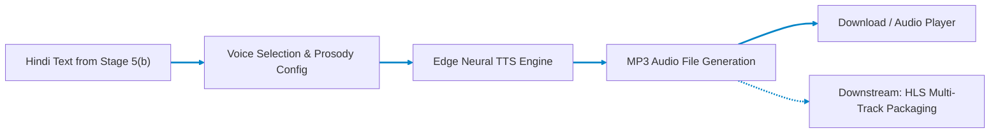
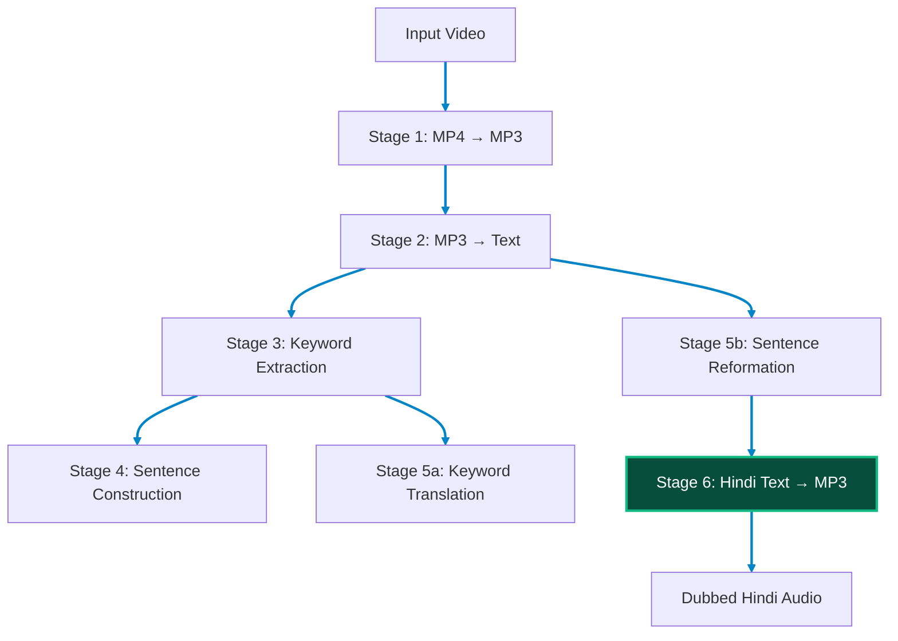

# Stage 6: Hindi Text → MP3 Speech Synthesis

## Neural TTS Voice Generation for the Nativox Pipeline

Part of the **Nativox** AI Multilingual Dubbing Suite.

[](../README.md)
[:_Reformation-3E8FC4?style=for-the-badge&logo=fastapi&logoColor=white)](../05b_Sentence_Reformation__Atanu/README.md)
[](../ARCHITECTURE.md)
[](https://python.org)
[](https://fastapi.tiangolo.com)

---

## 📖 Operational Overview

Stage 6 is the **final output stage** of the Nativox pipeline. It takes the reformed Hindi text produced by Stage 5(b) and synthesizes it into natural-sounding speech as a downloadable MP3 file using **Microsoft Edge Neural TTS** voices.

This stage closes the complete dubbing loop:

> `Video` → `Audio` → `Text` → `Keywords` → `Sentences` → `Translation` → `Reformation` → `Speech MP3`

### Key Capabilities

1. **Neural Hindi Speech Synthesis:** Converts Hindi text into studio-quality speech using `edge-tts` (Microsoft Edge Neural Voices) — no API key, no GPU required.
2. **Multi-Voice Selection:** Choose from multiple Hindi voices including female (`hi-IN-SwaraNeural`) and male (`hi-IN-MadhurNeural`) options.
3. **Prosody Control:** Adjust speech rate and pitch to match the original video's pacing and tone.
4. **Pipeline Integration:** Accepts direct output from Stage 5(b) (reformed Hindi sentences and précis) and produces the final dubbed audio track.

---

## 🛠️ Tech Stack & Key Features

- **Backend:** FastAPI (Python 3.11 asynchronous server)
- **TTS Engine:** `edge-tts` — Microsoft Edge Neural TTS (free, cloud-based, neural quality)
- **Frontend:** Glassmorphic dark-mode dashboard with voice selector, rate/pitch sliders, waveform visualization, and integrated audio player
- **Output:** Standard MP3 audio files ready for downstream HLS multi-track packaging

---

## 📋 Prerequisites & Requirements

- **Python:** **3.11** (Repository pinned via root `.python-version`)
- **Dependencies:** `fastapi`, `uvicorn`, `edge-tts`, `pydantic`, `aiofiles`
- **Internet:** Required — `edge-tts` uses Microsoft's online Neural TTS service

---

## 🚀 Setup & Execution

### 1. Navigate to Backend Directory

```bash
cd 06_Converted_Text_to_MP3/backend
```

### 2. Create & Activate Virtual Environment

- **Create Environment (Python 3.11):**

  ```bash
  python -m venv venv
  ```

- **Activate on Windows (PowerShell):**

  ```powershell
  .\venv\Scripts\Activate.ps1
  ```

- **Activate on Windows (CMD):**

  ```cmd
  venv\Scripts\activate.bat
  ```

- **Activate on macOS / Linux / Git Bash:**

  ```bash
  source venv/bin/activate
  ```

### 3. Install Dependencies & Launch Server

```bash
pip install -r requirements.txt
python -m uvicorn main:app --reload --port 8013
```

The web interface will open at **`http://127.0.0.1:8013`**.

> [!IMPORTANT]
> **Access via `http://127.0.0.1:8013`, not raw `index.html`:**
> The FastAPI backend serves `frontend/index.html` directly on port `8013`. Opening `index.html` directly via `file:///` causes browser CORS errors that block requests to `/api/synthesize`.

---

## 🏛️ Pipeline Architecture



### Full Pipeline Context



---

## 🔌 API Reference

### `POST /api/synthesize`

Converts Hindi text into an MP3 audio file.

- **Content-Type:** `application/json`
- **Request Body:**

  ```json
  {
    "text": "नमस्ते, यह एक परीक्षण है। हम न्यूरल नेटवर्क मॉडल को प्रशिक्षित करते हैं।",
    "voice": "hi-IN-SwaraNeural",
    "rate": "+0%",
    "pitch": "+0Hz"
  }
  ```

- **Response Body:**

  ```json
  {
    "audio_url": "/api/audio/tts_a1b2c3d4e5f6.mp3",
    "voice_used": "hi-IN-SwaraNeural",
    "text_length": 72,
    "word_count": 11
  }
  ```

### `GET /api/voices?locale=hi-IN`

Returns available Hindi TTS voices.

- **Response Body:**

  ```json
  {
    "locale_filter": "hi-IN",
    "count": 2,
    "voices": [
      {
        "short_name": "hi-IN-SwaraNeural",
        "friendly_name": "Microsoft Swara Online (Natural) - Hindi (India)",
        "gender": "Female",
        "locale": "hi-IN"
      },
      {
        "short_name": "hi-IN-MadhurNeural",
        "friendly_name": "Microsoft Madhur Online (Natural) - Hindi (India)",
        "gender": "Male",
        "locale": "hi-IN"
      }
    ]
  }
  ```

### `GET /api/audio/{filename}`

Serves a previously synthesized MP3 file for playback or download.

### `GET /api/health`

Returns service health status.

---

## 📁 Project Structure

```text
06_Converted_Text_to_MP3/
├── README.md                  # Stage documentation (this file)
├── backend/
│   ├── main.py                # FastAPI REST endpoints & static server
│   ├── requirements.txt       # edge-tts, FastAPI, Uvicorn, pydantic
│   ├── test_tts.py            # Unit & integration test suite
│   └── app/
│       ├── __init__.py        # Package init
│       ├── schemas.py         # Pydantic request & response models
│       └── tts_engine.py      # Edge-TTS synthesis engine
├── frontend/
│   ├── favicon.webp           # WebP brand favicon
│   └── index.html             # Real-time TTS synthesis dashboard
└── storage/
    └── outputs/               # Generated MP3 files (gitignored)
```

---

## 🧪 Running Tests

```bash
cd 06_Converted_Text_to_MP3/backend
python -m pytest test_tts.py -v
```

To skip integration tests that require internet:

```bash
SKIP_INTEGRATION=1 python -m pytest test_tts.py -v
```

---

## 👥 Authors & Academic Context

- **Student Contributors:** Atanu Saha, Babin Bid, Rohit Kr Adak, Sagnik Bachhar
- **Faculty Guide:** Dr. Debjit Ghosh (Department of Computer Science & Engineering)
- **Suite:** Nativox Modular Real-Time AI Multilingual Dubbing Suite

---

<!-- markdownlint-disable MD033 -->
<p align="center">
  <a href="../README.md">🏠 Back to Suite Overview</a> &bull; <a href="../ARCHITECTURE.md">🏛️ Architecture</a> &bull; <a href="../INSTRUCTIONS.md">📖 Instructions</a> &bull; <a href="../ROADMAP.md">🗺️ Roadmap</a>
</p>

<p align="center">
  <sub><b>Nativox</b> &bull; Real-Time AI Multilingual Dubbing Suite &bull; <b>End of Module 6 Documentation</b></sub>
</p>
<!-- markdownlint-enable MD033 -->
