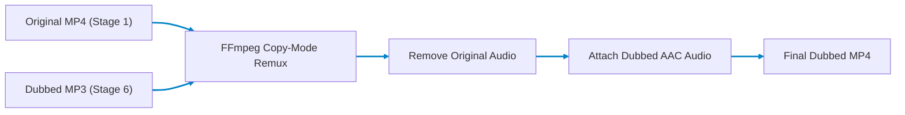
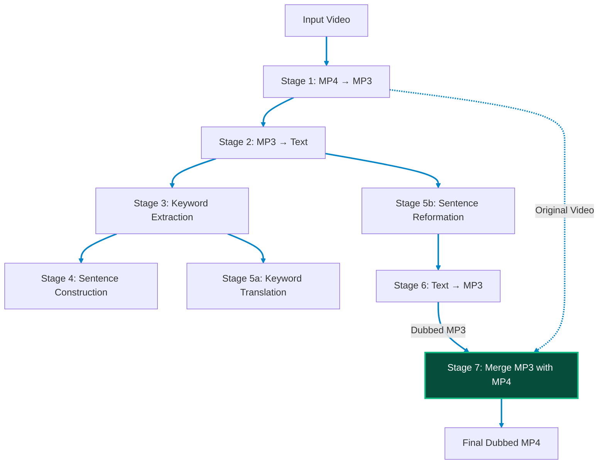

# Stage 7: Merge MP3 with MP4

## Final Dubbed Video Assembly for the Nativox Pipeline

Part of the **Nativox** AI Multilingual Dubbing Suite.

<!-- markdownlint-disable MD033 -->
<p align="center">
  <a href="../README.md"></a>
  <a href="../06_Converted_Text_to_MP3/README.md"></a>
  <a href="../ARCHITECTURE.md"></a>
  <a href="https://python.org"></a>
  <a href="https://fastapi.tiangolo.com"></a>
  <a href="https://ffmpeg.org"></a>
</p>

---

## 📖 Operational Overview

Stage 7 is the **final stage** of the Nativox pipeline. It takes the original source MP4 video (from Stage 1) and the target-language MP3 audio (from Stage 6), removes the original English audio track, and attaches the dubbed MP3 — producing the final dubbed MP4 with original video frames preserved byte-for-byte.

This stage closes the complete dubbing loop:

> `English Video` → `Audio` → `Text` → `Keywords` → `Sentences` → `Translation` → `Reformation` → `Dubbed Speech` → **`Final Dubbed Video`**

### Key Capabilities

1. **Copy-Mode Remux:** Preserves original video frames byte-for-byte using FFmpeg's `-c:v copy` — zero quality loss, near-instant processing, no GPU required.
2. **Audio Replacement:** Completely removes the original English audio track and attaches the dubbed target-language MP3 as the sole audio stream.
3. **AAC Transcoding:** Transcodes the MP3 audio to AAC (`-c:a aac -b:a 192k`) for maximum MP4 container compatibility across all players and browsers.
4. **Duration Safety:** Uses `-shortest` flag to handle duration mismatches between video and dubbed audio, preventing silent padding or video truncation.
5. **FastStart Optimization:** Applies `-movflags +faststart` to move the MOOV atom to the beginning of the file for instant web playback without buffering.
6. **Language-Agnostic:** Accepts any MP3 audio file — works with Hindi, Bengali, or any future target language.

---

## 🛠️ Tech Stack & Architectural Justification

| Technology | Purpose in Pipeline | Why It Is Chosen Over Existing Alternatives | Viable Alternatives & Trade-Off Analysis |
| :--- | :--- | :--- | :--- |
| **FastAPI + Uvicorn** | Asynchronous REST API serving merge endpoints (`/api/merge`) and video file delivery (`/api/video/{filename}`). | Native `async`/`await` architecture handles large file uploads via chunked streaming without blocking worker threads. Provides built-in Swagger/OpenAPI documentation. | **Flask**: Synchronous blocking architecture requires WSGI thread pools that stall during large file uploads and FFmpeg subprocess waits.<br>**Express.js**: Requires external Node child processes to run FFmpeg commands. |
| **FFmpeg (Copy-Mode Remux)** | Replaces the original audio track with dubbed MP3 while preserving video frames byte-for-byte. Uses `-c:v copy` (no video re-encoding) and `-c:a aac` (audio transcode to AAC). | Near-instant processing since video frames are copied without decoding. Zero quality loss. No GPU required. The `-movflags +faststart` flag ensures instant web playback. | **MoviePy**: Python wrapper around FFmpeg but adds unnecessary abstraction, slower startup, and does not support copy-mode remux natively — always re-encodes video.<br>**OpenCV**: Only handles video frames, cannot manipulate audio streams or produce correctly muxed MP4 containers.<br>**ffmpeg-python**: Thin Python binding that still calls FFmpeg subprocess — adds a dependency without meaningful benefit over direct subprocess calls. |
| **FFprobe (JSON Metadata)** | Extracts duration, codec, resolution, and file size metadata for input validation and output verification. | Ships alongside FFmpeg (zero extra installation). Produces structured JSON output (`-print_format json`) that is trivially parseable. | **MediaInfo**: Separate installation, heavier binary, and more complex CLI output parsing.<br>**pymediainfo**: Python wrapper requiring MediaInfo system library installation. |
| **Vanilla Glassmorphic Dark-Mode UI** | Dual file upload zones with drag-and-drop, duration comparison display, video preview player, and download controls. | Standalone zero-npm dependency setup that runs instantly across any browser. Consistent with Stages 1–6 design system. | **React / Angular**: Heavy node_modules tree and build dependencies unnecessary for an integrated pipeline micro-frontend. |

---

## 📋 Prerequisites & Requirements

- **Python:** **3.11** (Repository pinned via root `.python-version`)
- **FFmpeg:** Required — handles all media processing
  - **Windows:** `winget install Gyan.FFmpeg`
  - **macOS:** `brew install ffmpeg`
  - **Ubuntu/Debian:** `sudo apt update && sudo apt install -y ffmpeg`
- **Dependencies:** `fastapi`, `uvicorn`, `pydantic`, `aiofiles`

---

## 🚀 Setup & Execution

### 1. Navigate to Backend Directory

```bash
cd 07_Merge_MP3_with_MP4/backend
```

### 2. Create & Activate Virtual Environment

- **Create Environment (Python 3.11):**

  ```bash
  python -m venv venv
  ```

- **Activate on Windows (PowerShell):**

  ```powershell
  .\venv\Scripts\Activate.ps1
  ```

- **Activate on Windows (CMD):**

  ```cmd
  venv\Scripts\activate.bat
  ```

- **Activate on Windows (Git Bash):**

  ```bash
  source venv/Scripts/activate
  ```

- **Activate on macOS / Linux:**

  ```bash
  source venv/bin/activate
  ```

### 3. Install Dependencies & Launch Server

```bash
pip install -r requirements.txt
python -m uvicorn main:app --reload --port 8014
```

The web interface will open at **`http://127.0.0.1:8014`**.

> [!IMPORTANT]
> **Access via `http://127.0.0.1:8014`, not raw `index.html`:**
> The FastAPI backend serves `frontend/index.html` directly on port `8014`. Opening `index.html` directly via `file:///` causes browser CORS errors that block requests to `/api/merge`.

---

## 🏛️ Pipeline Architecture



### Full Pipeline Context



---

## 🔌 API Reference

### `POST /api/merge`

Merges an original video with dubbed audio to produce the final dubbed MP4.

- **Content-Type:** `multipart/form-data`
- **Request Fields:**

  | Field | Type | Description |
  | :--- | :--- | :--- |
  | `video` | File | Original source MP4 video |
  | `audio` | File | Dubbed target-language MP3 audio |

- **Response Body:**

  ```json
  {
    "video_url": "/api/video/dubbed_a1b2c3d4e5.mp4",
    "original_video_duration": "00:02:15.340",
    "dubbed_audio_duration": "00:02:08.120",
    "output_duration": "00:02:08.120",
    "video_codec": "copy (original preserved)",
    "audio_codec": "aac",
    "resolution": "1920x1080",
    "file_size_mb": 18.42
  }
  ```

### `GET /api/video/{filename}`

Serves a previously merged dubbed MP4 file for playback or download.

### `GET /api/probe/{filename}`

Returns FFprobe metadata for a file in the output directory.

- **Response Body:**

  ```json
  {
    "filename": "dubbed_a1b2c3d4e5.mp4",
    "duration": "00:02:08.120",
    "video_codec": "h264",
    "audio_codec": "aac",
    "resolution": "1920x1080",
    "file_size_mb": 18.42
  }
  ```

### `GET /api/health`

Returns service health status and FFmpeg availability.

---

## 📁 Project Structure

```text
07_Merge_MP3_with_MP4/
├── README.md                  # Stage documentation (this file)
├── backend/
│   ├── main.py                # FastAPI REST endpoints & static server
│   ├── requirements.txt       # FastAPI, Uvicorn, pydantic
│   ├── test_merge.py          # Unit & integration test suite
│   └── app/
│       ├── __init__.py        # Package init
│       ├── schemas.py         # Pydantic request & response models
│       └── merger.py          # FFmpeg merge engine & media probe
├── frontend/
│   ├── favicon.webp           # WebP brand favicon
│   └── index.html             # Merge dashboard with dual upload zones
└── storage/
    └── outputs/               # Merged dubbed MP4 files (gitignored)
```

---

## 🧪 Running Tests

```bash
cd 07_Merge_MP3_with_MP4/backend
python -m pytest test_merge.py -v
```

> [!NOTE]
> Integration tests require FFmpeg to be installed. Tests will be skipped automatically if FFmpeg is not found.

---

## 👥 Authors & Academic Context

- **Student Contributors:** Atanu Saha, Babin Bid, Rohit Kr Adak, Sagnik Bachhar
- **Faculty Guide:** Dr. Debjit Ghosh (Department of Computer Science & Engineering)
- **Suite:** Nativox Modular Real-Time AI Multilingual Dubbing Suite

---

<!-- markdownlint-disable MD033 -->
<p align="center">
  <a href="../README.md">🏠 Back to Suite Overview</a> &bull; <a href="../ARCHITECTURE.md">🏛️ Architecture</a> &bull; <a href="../INSTRUCTIONS.md">📖 Instructions</a> &bull; <a href="../ROADMAP.md">🗺️ Roadmap</a>
</p>

<p align="center">
  <sub><b>Nativox</b> &bull; Real-Time AI Multilingual Dubbing Suite &bull; <b>End of Module 7 Documentation</b></sub>
</p>
<!-- markdownlint-enable MD033 -->
