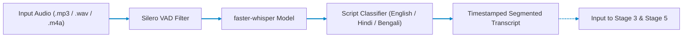

# Stage 2: Audio to Text (ASR) Engine

## Multilingual Automatic Speech Recognition for English, Hindi, & Bengali

Part of the **Nativox** AI Multilingual Dubbing Suite.

[](../README.md)
[](../1.%20mp4%20to%20mp3/README.md)
[](../3.%20Text%20to%20Keyword/README.md)
[](../ARCHITECTURE.md)
[](https://python.org)
[](https://github.com/SYSTRAN/faster-whisper)

---

## 📖 Operational Overview

Stage 2 handles automatic speech recognition (ASR) for the Nativox pipeline. It takes audio files (such as the MP3 generated by **Stage 1**) or direct microphone recordings, applies voice activity detection (VAD), and generates clean, timestamped transcriptions in **English**, **Hindi (Devanagari)**, and **Bengali (Bangla script)**.

The resulting transcript feeds directly into **Stage 3 (Salient Keyword Extraction)** and **Stage 5 (Sentence Reformation & Précis)**.

---

## 🛠️ Tech Stack & Key Features

- **Inference Engine:** [faster-whisper](https://github.com/SYSTRAN/faster-whisper) (CTranslate2-accelerated implementation of OpenAI Whisper)
- **Execution Target:** CPU (INT8 quantized) or GPU (FP16 / CUDA accelerated)
- **Local & Privacy-Preserving:** 100% offline inference with zero third-party API dependencies
- **Language Detection:** Real-time automatic language identification and confidence scoring across English, Hindi, and Bengali
- **Frontend Interface:** Synchronized waveform audio player on the left with formatted transcript viewer on the right

---

## 📋 Prerequisites & Requirements

- **Python:** **3.11** (Repository pinned via root `.python-version`)
- **Disk Space:** ~150 MB for default `base` or ~500 MB for `small` Whisper model weights (automatically downloaded on first execution to `~/.cache/huggingface/hub/`)

---

## 🚀 Setup & Execution

### 1. Navigate to Backend Directory

```bash
cd "2. mp3 to Text/backend"
```

### 2. Create & Activate Virtual Environment

- **Create Environment (Python 3.11):**

  ```bash
  python -m venv venv
  ```

- **Activate on Windows (PowerShell):**

  ```powershell
  .\venv\Scripts\Activate.ps1
  ```

- **Activate on Windows (CMD):**

  ```cmd
  venv\Scripts\activate.bat
  ```

- **Activate on macOS / Linux / Git Bash:**

  ```bash
  source venv/bin/activate
  ```

### 3. Install Dependencies & Launch Server

```bash
pip install -r requirements.txt
python -m uvicorn main:app --reload --port 8001
```

The web dashboard will be available at: **`http://127.0.0.1:8001`**

> [!IMPORTANT]
> **Access via `http://127.0.0.1:8001`, not raw `index.html`:**
> The FastAPI backend serves `frontend/index.html` directly on port `8001`. Opening `index.html` directly as a local `file:///` path causes browser CORS errors with `/api/transcribe`.

---

## 🏛️ Pipeline Architecture



---

## 🔌 API Reference

### `POST /api/transcribe`

Transcribes uploaded audio into timestamped segments.

- **Content-Type:** `multipart/form-data`
- **Parameters:**
  - `file`: Audio file (`.mp3`, `.wav`, `.m4a`, `.flac`, `.ogg`)
  - `language`: `auto`, `en`, `hi`, or `bn` (default: `auto`)
- **Response:**

  ```json
  {
    "detected_language": "hi",
    "language_probability": 0.984,
    "duration": 18.5,
    "full_transcript": "इस वीडियो में हम न्यूरल नेटवर्क के बारे में सीखेंगे।",
    "segments": [
      {
        "id": 0,
        "start": 0.0,
        "end": 3.8,
        "text": "इस वीडियो में हम न्यूरल नेटवर्क के बारे में सीखेंगे।"
      }
    ]
  }
  ```

---

## 📁 Project Structure

```text
2. mp3 to Text/
├── README.md               # Stage documentation
├── backend/
│   ├── main.py             # FastAPI routing and static file delivery
│   ├── requirements.txt    # faster-whisper, FastAPI, Uvicorn
│   └── app/
│       ├── config.py       # Model size selection and file upload limits
│       └── transcriber.py  # Model loader and inference wrapper with LRU caching
└── frontend/
    └── index.html          # Dual-column interactive audio and transcript interface
```

---

## 👥 Authors & Academic Context

- **Student Contributors:** Atanu Saha, Babin Bid, Rohit Kr Adak, Sagnik Bachhar
- **Faculty Guide:** Dr. Debjit Ghosh (Department of Computer Science & Engineering)
- **Suite:** Nativox Modular Real-Time AI Multilingual Dubbing Suite

---

<p align="center">
  <a href="../README.md">🏠 Back to Suite Overview</a> &bull; <a href="../ARCHITECTURE.md">🏛️ Architecture</a> &bull; <a href="../INSTRUCTIONS.md">📖 Instructions</a> &bull; <a href="../ROADMAP.md">🗺️ Roadmap</a>
</p>

<p align="center">
  <sub><b>Nativox</b> &bull; Real-Time AI Multilingual Dubbing Suite &bull; <b>End of Module 2 Documentation</b></sub>
</p>
