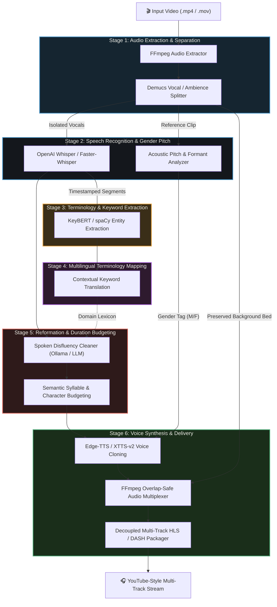

# Nativox Architecture & Modular Pipeline Design

This document details the modular component architecture of **Nativox**, tracking how each standalone stage interfaces with the pipeline to deliver real-time, contextually accurate video dubbing.

---

## 🏛️ High-Level Component Flow

---

## 🔍 Stage Specifications

### 1. Stage 1: `1. mp4 to mp3/`

- **Responsibility:** Ingest incoming media and decouple audio streams.
- **Port:** `8000` (standalone)
- **Core Operations:**
  - FFmpeg audio extraction (`-vn -acodec libmp3lame -q:a 2`).
  - Vocal and background instrumental separation.

### 2. Stage 2: `2. mp3 to Text/`

- **Responsibility:** High-precision acoustic transcription and speaker feature extraction.
- **Port:** `8001` (standalone)
- **Core Operations:**
  - Whisper ASR with millisecond start/end timestamps per sentence segment.
  - Formant and pitch detection for automatic gender identification (Male/Female voice selection).

### 3. Stage 3: `3. Text to Keyword/`

- **Responsibility:** Identify technical vocabulary and domain terms that require specialized translation.
- **Port:** `8002` (standalone)
- **Core Operations:**
  - KeyBERT sentence-transformers embeddings with MMR (Maximal Marginal Relevance) diversification.
  - Filtering stopwords and highlighting critical technical jargon.

### 4. Stage 4: `4. Keyword Translate/`

- **Responsibility:** Multilingual glossary resolution.
- **Port:** `8003` (standalone)
- **Core Operations:**
  - Translates isolated domain entities and noun phrases.
  - Guarantees technical words (e.g. "Transformer", "Backpropagation") are either preserved in English or matched to accepted standardized vernacular terms.

### 5. Stage 5: `5. Sentence Reformation/`

- **Responsibility:** Spoken disfluency cleaning, syntax restoration, and duration-budgeted 35%–40% précis compression (English to Hindi).
- **Port:** `8012` (standalone)
- **Core Operations:**
  - Removal of spoken disfluencies (*um, uh, you know, like*) and predicate restructuring (SVO to Indic SOV).
  - Algorithmic précis compression reducing full MP3 transcript paragraphs to 35%–40% length while preserving semantic integrity and core technical facts.
  - Contextual Hindi translation with proper postpositions (*vibhakti*) and grammatical case markers.

---

## ⚡ Integration into Unified Delivery

While each stage runs independently for research evaluation and testing, the modular pipeline stages chain together with asynchronous job management, real-time status events, and decoupled HLS output generation.
