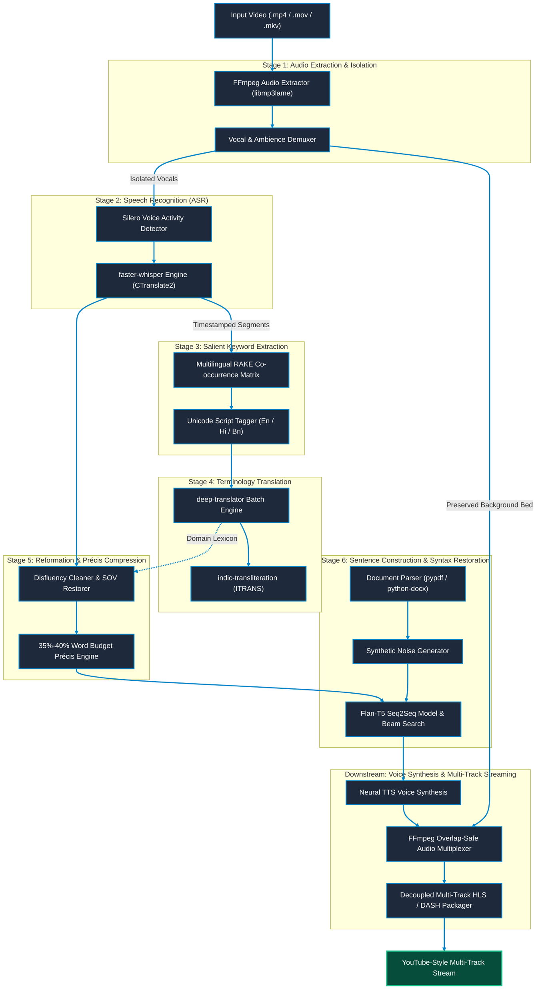

# Nativox Architecture & Modular Pipeline Design

This document details the modular component architecture of **Nativox**, tracking how each standalone stage interfaces with the pipeline to deliver real-time, contextually accurate video dubbing.

---

## 🏛️ High-Level Component Flow

---

## 🔍 Stage Specifications

### 1. Stage 1: `1. mp4 to mp3/`

- **Responsibility:** Ingest incoming media and extract pristine audio.
- **Port:** `http://127.0.0.1:8000`
- **Core Operations:**
  - FFmpeg high-bitrate audio extraction (`-vn -acodec libmp3lame -q:a 2`).
  - Web-based side-by-side synchronized video and audio playback preview.

### 2. Stage 2: `2. mp3 to Text/`

- **Responsibility:** High-precision acoustic transcription with timestamped speech segments.
- **Port:** `http://127.0.0.1:8001`
- **Core Operations:**
  - Silero VAD for non-speech and silence filtering.
  - `faster-whisper` (CTranslate2) with INT8 CPU and FP16 GPU inference.
  - Tri-lingual support with automatic script classification for English, Hindi (Devanagari), and Bengali (Bangla script).

### 3. Stage 3: `3. Text to Keyword/`

- **Responsibility:** Extract salient content-bearing keywords and domain terminology.
- **Port:** `http://127.0.0.1:8010`
- **Core Operations:**
  - Multilingual RAKE co-occurrence matrix scoring ($W_{\text{deg}} / W_{\text{freq}}$).
  - Curated joint stopword lists for English, Hindi, and Bengali.
  - Code-mixed spoken sentence processing without language segmentation overhead.

### 4. Stage 4: `4. Keyword Translate/`

- **Responsibility:** Multilingual terminology translation and phonetic guide generation.
- **Port:** `http://127.0.0.1:8011`
- **Core Operations:**
  - `deep-translator` batch terminology mapping with failover resilience.
  - `indic-transliteration` (ITRANS / Harvard-Kyoto) phonetic pronunciation guide synthesis for Indic text.
  - Fast Unicode script detection without expensive model overhead.

### 5. Stage 5: `5. Sentence Reformation/`

- **Responsibility:** Disfluency removal, SOV grammar restoration, and 35%–40% précis compression.
- **Port:** `http://127.0.0.1:8012`
- **Core Operations:**
  - Strips verbal disfluencies (*um, uh, basically, you know*) and restores predicate structure.
  - Enforces the faculty-directed 35%–40% paragraph word budget window:
    $$\lfloor 0.35 \times W_{\text{orig}} \rfloor \le W_{\text{precis}} \le \lceil 0.40 \times W_{\text{orig}} \rceil$$
  - Contextual Hindi translation with proper postpositions (*vibhakti*) and grammatical case markers.

### 6. Stage 6: `6. Sectence Construction/`

- **Responsibility:** Document-trained sentence syntax learning and destructive-to-constructive sentence reconstruction.
- **Interface:** CLI & Script Runner (`train.py`, `construct.py`)
- **Core Operations:**
  - Ingestion of standard PDF (`.pdf`) and Word (`.docx`) documents using `pypdf` and `python-docx`.
  - Self-supervised synthetic corruption (`SentenceCorrupter`): token jumbling, function word dropping, and grammatical inflection noise.
  - Fine-tuning of Google Flan-T5 Seq2Seq Transformer model using AdamW optimizer.
  - Multi-beam search decoding for real-time reconstruction of fragmented input sentences.

---

## ⚡ Integration into Unified Delivery

While each stage runs independently for academic evaluation and unit benchmarking, the modular pipeline stages chain together with asynchronous job management, real-time status events, and decoupled HLS output generation:

1. Stage 1 extracts raw audio from incoming video.
2. Stage 2 transcribes speech into timestamped tokens.
3. Stage 3 isolates domain keywords.
4. Stage 4 maps keywords to the target language and generates phonetic guides.
5. Stage 5 removes fillers and compresses paragraphs to a strict 35%–40% duration budget.
6. Stage 6 provides neural syntax reconstruction trained on reference documents.
7. Downstream neural TTS synthesizes voice tracks that are muxed into decoupled HLS multi-track streams.

---

## 👥 Authors & Academic Context

- **Student Contributors:** Atanu Saha, Babin Bid, Rohit Kr Adak, Sagnik Bachhar
- **Faculty Guide:** Dr. Debjit Ghosh (Department of Computer Science & Engineering)
- **Suite:** Nativox Modular Real-Time AI Multilingual Dubbing Suite

---

  <a href="README.md">🏠 Suite Overview</a> &bull; <a href="ARCHITECTURE.md">🏛️ Architecture</a> &bull; <a href="INSTRUCTIONS.md">📖 Instructions</a> &bull; <a href="ROADMAP.md">🗺️ Roadmap</a>

  <b>Nativox</b> &bull; Real-Time AI Multilingual Dubbing Suite &bull; <b>End of Architecture Specification</b>

