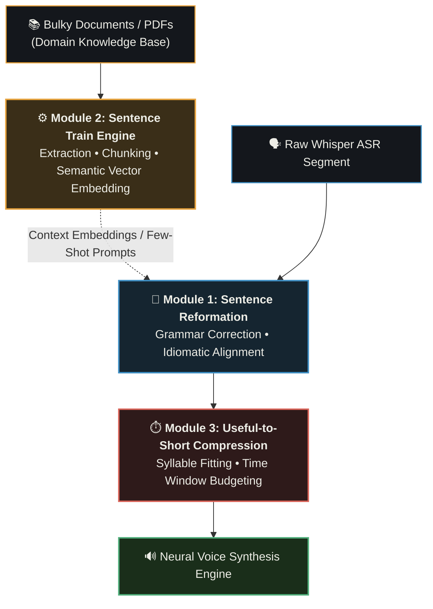

# Future Roadmap & Faculty Directives

Faculty Directives and Real-Time YouTube-Style Dubbing Evolution.

---

## 📑 Core Faculty Directives & Engineering Milestones

This roadmap outlines the evolution of the **Nativox** suite from standalone modular stages into a real-time, low-latency, streaming multilingual video dubbing platform.

---

### Directive 1: Sentence Reformation (Contextual Restructuring)
* **Goal:** Convert raw transcribed speech into natural, spoken colloquial syntax.
* **Key Tasks:**
  - Remove speech fillers (*um, uh, you know, like*) and false starts.
  - Reconstruct Subject-Verb-Object (SVO, English) into natural Subject-Object-Verb (SOV, Indic languages like Hindi/Bengali).
  - Match gender and honorific registers (*आप* vs. *तुम*; *আপনি* vs. *তুমি*).

---

### Directive 2: Sentence Training Engine (Document/PDF Ingestion)
* **Goal:** Ingest domain-specific bulky documents (research papers, textbooks, scripts) so technical terms are accurately translated.
* **Key Tasks:**
  - PDF/DOCX text extraction using `pypdf` and semantic sliding-window chunking.
  - ChromaDB / FAISS vector database embedding for real-time terminology retrieval (RAG).
  - Retain specialized nomenclature in source English or officially accepted vernacular translations.

---

### Directive 3: Useful-to-Short Sentence Compression (Duration Budgeting)
* **Goal:** Prevent speech overflow and overlap when translated sentences require more syllables than the video time gap allows.
* **Key Tasks:**
  - Calculate segment duration budget: $T = \text{segment.end} - \text{segment.start}$.
  - Compute maximum allowable characters based on natural speaking rate ($\sim 14$ characters/second).
  - Dynamically prompt compact LLM rewriting to fit the exact millisecond time window without robotic `atempo` warping.

---

### Directive 4: YouTube-Style Decoupled Multi-Audio Track Delivery (HLS/DASH)
* **Goal:** Zero video re-encoding and instant, buffer-free language switching in the player.
* **Key Tasks:**
  - Keep the original master video track untouched.
  - Stream dubbed speech on secondary AAC audio tracks linked through an HLS manifest (`master.m3u8`).
  - Allow instant audio language switching in frontend video players.
