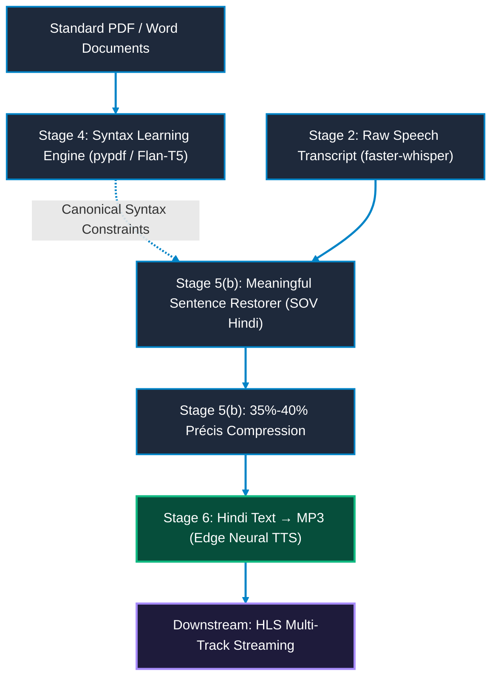

# Future Roadmap & Faculty Directives

Faculty Directives and Real-Time YouTube-Style Dubbing Evolution.

---

## 📑 Core Faculty Directives & Engineering Milestones

This roadmap outlines the evolution of the **Nativox** suite from standalone modular stages into a real-time, low-latency, streaming multilingual video dubbing platform.

---

### Directive 1: Sentence Reformation (Contextual Restructuring) — [Completed: Stage 5(b)]

- **Status:** **Completed** in [`05b_Sentence_Reformation__Atanu/`](05b_Sentence_Reformation__Atanu/README.md)
- **Implemented Capabilities:**
  - Removes verbal fillers (*um, uh, basically, you know*) and false speech starts.
  - Reconstructs Subject-Verb-Object (SVO, English) into natural Subject-Object-Verb (SOV, Indic languages like Hindi/Bengali).
  - Automatically inserts Hindi case markers (*ne, ko, se, mein*) and restores predicate coherence.

---

### Directive 2: Sentence Training Engine (Document/PDF Ingestion) — [Completed: Stage 4]

- **Status:** **Completed** in [`04_Keyword_to_Sentence_Construction/`](04_Keyword_to_Sentence_Construction/README.md)
- **Implemented Capabilities:**
  - PDF/DOCX text extraction using `pypdf` and `python-docx`.
  - Self-supervised synthetic corruption engine (`SentenceCorrupter`) applying word jumbling, function word dropping, and grammatical inflection distortion.
  - Seq2Seq Transformer fine-tuning pipeline on Google Flan-T5 with multi-beam search decoding in `construct.py`.

---

### Directive 3: Useful-to-Short Sentence Compression (Duration Budgeting) — [Completed: Stage 5(b) & Ongoing]

- **Status:** **Core Engine Completed** in [`05b_Sentence_Reformation__Atanu/`](05b_Sentence_Reformation__Atanu/README.md)
- **Implemented Capabilities & Next Steps:**
  - Enforces strict 35%–40% word budget window:
    $$\lfloor 0.35 \times W_{\text{orig}} \rfloor \le W_{\text{precis}} \le \lceil 0.40 \times W_{\text{orig}} \rceil$$
  - Prevents speech overflow when translated Indic syllables exceed the original video duration window.
  - Next milestone: Dynamic phoneme-level duration matching with millisecond speech timestamps.

---

### Directive 4: YouTube-Style Decoupled Multi-Audio Track Delivery (HLS/DASH) — [Upcoming Milestone]

- **Status:** **In Design & Implementation**
- **Target Milestones:**
  - Zero video re-encoding: Keeps the master video track untouched and streams dubbed speech on secondary AAC audio tracks linked through an HLS manifest (`master.m3u8`).
  - Seamless buffer-free language switching in frontend HTML5 video players.
  - Multi-speaker voice cloning and pitch-preserving gender-matched neural TTS synthesis.
  - Integration with Stage 6 MP3 output as the primary dubbed audio source.

---

### Directive 5: Hindi Text → MP3 Speech Synthesis — [Completed: Stage 6]

- **Status:** **Completed** in [`06_Converted_Text_to_MP3/`](06_Converted_Text_to_MP3/README.md)
- **Implemented Capabilities:**
  - Microsoft Edge Neural TTS synthesis via `edge-tts` — zero API keys, zero GPU.
  - Multi-voice selection: female (`hi-IN-SwaraNeural`) and male (`hi-IN-MadhurNeural`) Hindi voices.
  - Prosody control with adjustable speech rate (`-50%` to `+50%`) and pitch (`-20Hz` to `+20Hz`).
  - Produces standard MP3 files ready for downstream HLS multi-track packaging.
  - Closes the full dubbing pipeline: **Video → Audio → Text → Keywords → Sentences → Translation → Reformation → Speech MP3**.

---

## 👥 Authors & Academic Context

- **Student Contributors:** Atanu Saha, Babin Bid, Rohit Kr Adak, Sagnik Bachhar
- **Faculty Guide:** Dr. Debjit Ghosh (Department of Computer Science & Engineering)
- **Suite:** Nativox Modular Real-Time AI Multilingual Dubbing Suite

---

<!-- markdownlint-disable MD033 -->

  <a href="README.md">🏠 Suite Overview</a> &bull; <a href="ARCHITECTURE.md">🏛️ Architecture</a> &bull; <a href="INSTRUCTIONS.md">📖 Instructions</a> &bull; <a href="ROADMAP.md">🗺️ Roadmap</a>

  <b>Nativox</b> &bull; Real-Time AI Multilingual Dubbing Suite &bull; <b>End of Roadmap Specification</b>

<!-- markdownlint-enable MD033 -->
